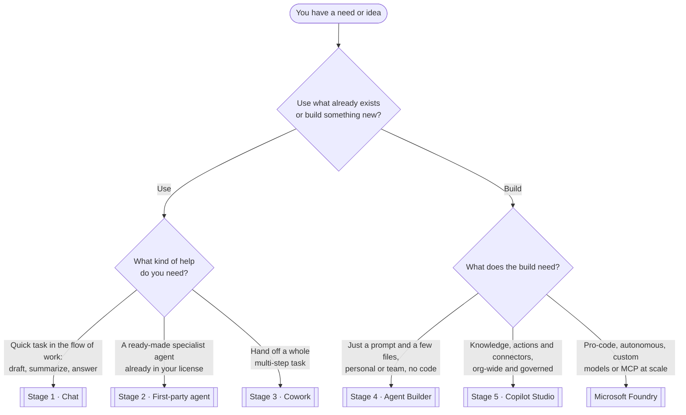

# Choose the right path

The most common waste in early AI adoption is **building in the wrong place** — a throwaway task turned into a
full Copilot Studio agent, or a production workflow trapped inside a personal Agent Builder agent. This page
is the empowerment team's routing tool: answer a few questions and land on the surface that fits.

!!! warning "Unofficial — a guide, not a rule"
    This routes the *typical* case. Real decisions also weigh licensing, data sensitivity, and who will own the
    result. Use it to start the conversation, then confirm against [Licensing & Prerequisites](../prerequisites.md)
    and Microsoft's [which Copilot is right for you](https://learn.microsoft.com/en-us/copilot/) hub.

---

## The decision tree

The first fork is the one that matters most: **are you trying to *use* what's already there, or *build*
something new?** Everything else follows from that.

---

## Read it as a table

Prefer words to boxes? Same logic, top to bottom — the first row that matches is usually your answer.

| If you want to… | …and it looks like | Go to |
| --- | --- | --- |
| **Use** Copilot for a quick task | Draft, summarize, rewrite, answer — in the flow of work | [Stage 1 · Chat](../stages/stage-1-chat.md) |
| **Use** a ready-made specialist | A capability already included in your license (research, analysis, facilitation) | [Stage 2 · First-party agents](../stages/stage-2-first-party.md) |
| **Use** Copilot for a whole task | Hand off a multi-step job and let it run | [Stage 3 · Cowork](../stages/stage-3-cowork.md) |
| **Build** something simple, fast | A prompt plus a few reference files, for you or your team, no code | [Stage 4 · Agent Builder](../stages/stage-4-agent-builder.md) |
| **Build** for production | Real knowledge sources, actions/connectors, org-wide reach, lifecycle and governance | [Stage 5 · Copilot Studio](../stages/stage-5-studio.md) |
| **Build** at the frontier | Pro-code, autonomous or triggered agents, custom models, MCP at scale | [Microsoft Foundry](https://learn.microsoft.com/en-us/azure/ai-foundry/) |

---

## What each destination means

- **[Stage 1 · Chat](../stages/stage-1-chat.md)** — the fastest value. If the need is a single task in the flow
  of work, you almost never need to build anything.
- **[Stage 2 · First-party agents](../stages/stage-2-first-party.md)** — before you build, check what Microsoft
  already ships. The best agent is often the one you don't have to make.
- **[Stage 3 · Cowork](../stages/stage-3-cowork.md)** — when a task is *multi-step* but still a one-off, hand
  the whole thing off rather than building a reusable agent.
- **[Stage 4 · Agent Builder](../stages/stage-4-agent-builder.md)** — the right home when the same delegated task
  keeps recurring and a prompt-plus-files agent solves it. No code, personal or team scope.
- **[Stage 5 · Copilot Studio](../stages/stage-5-studio.md)** — where agents grow up: real knowledge sources,
  connectors and actions, publishing, monitoring, and governance for org-wide use.
- **[Microsoft Foundry](https://learn.microsoft.com/en-us/azure/ai-foundry/)** — the pro-code frontier:
  autonomous and triggered agents, custom models, evaluation, and MCP tools at scale.

!!! tip "When in doubt, climb only one rung"
    If two destinations feel plausible, pick the **simpler** one first. It's far cheaper to graduate a working
    Agent Builder agent into Studio later than to over-build on day one. Each stage is designed to make the next
    feel obvious — see [Start Here](../start-here.md).

> **📚 Learn more.**
>
> - [Which Copilot is right for you](https://learn.microsoft.com/en-us/copilot/) — Microsoft's official front door.
> - [Extend Microsoft 365 Copilot — options compared](https://learn.microsoft.com/en-us/microsoft-365-copilot/extensibility/) — declarative vs. custom-engine agents.
> - [Microsoft Foundry](https://learn.microsoft.com/en-us/azure/ai-foundry/) — when you outgrow low-code.
