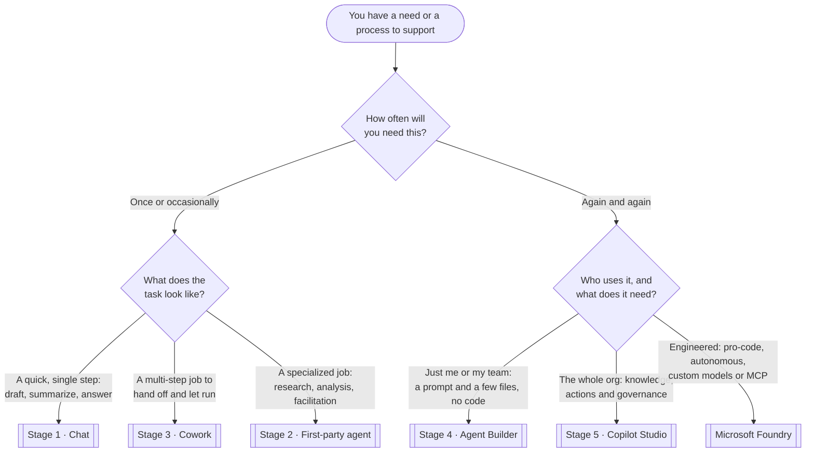

# Choose the right path

The most common waste in early AI adoption is **building in the wrong place** — a throwaway task turned into a
full Copilot Studio agent, or a production workflow trapped inside a personal Agent Builder agent. This page
is the empowerment team's routing tool: answer a few questions and land on the surface that fits.

!!! warning "Unofficial — a guide, not a rule"
    This routes the *typical* case. Real decisions also weigh licensing, data sensitivity, and who will own the
    result. Use it to start the conversation, then confirm against [Licensing & Prerequisites](../prerequisites.md)
    and Microsoft's [which Copilot is right for you](https://learn.microsoft.com/en-us/copilot/) hub.

---

## The decision tree

Lead with the **process, not the product**. The first question is simply *how often you'll need this* — a
one-off versus a repeatable need — and the shape of the work does the rest. You don't have to know which
tools exist to land in the right place.

!!! tip "Prefer to click through it?"
    The [Path Finder](wizard.md) walks you through these same questions one at a time and lands you on a
    recommendation card — two clicks to an answer.

---

## Read it as a table

Prefer words to boxes? Find the row whose **need** matches yours — frequency first, then shape.

| If your need is… | …and it looks like | Go to |
| --- | --- | --- |
| **One-off · quick** | A single step — draft, summarize, rewrite, answer — right now | [Stage 1 · Chat](../stages/stage-1-chat.md) |
| **One-off · specialized** | Deep research, data analysis, or facilitation | [Stage 2 · First-party agents](../stages/stage-2-first-party.md) |
| **One-off · multi-step** | A several-step job you'd rather hand off and let run | [Stage 3 · Cowork](../stages/stage-3-cowork.md) |
| **Recurring · simple** | The same task again and again; a prompt plus a few files, no code | [Stage 4 · Agent Builder](../stages/stage-4-agent-builder.md) |
| **Recurring · org-wide** | Real knowledge sources, actions/connectors, lifecycle and governance | [Stage 5 · Copilot Studio](../stages/stage-5-studio.md) |
| **Recurring · engineered** | Pro-code, autonomous or triggered, custom models, MCP at scale | [Stage 6 · Foundry](../stages/stage-6-foundry.md) |

---

## What each destination means

- **[Stage 1 · Chat](../stages/stage-1-chat.md)** — the fastest value. If the need is a single task in the flow
  of work, you almost never need to build anything.
- **[Stage 2 · First-party agents](../stages/stage-2-first-party.md)** — before you build, check what Microsoft
  already ships. The best agent is often the one you don't have to make.
- **[Stage 3 · Cowork](../stages/stage-3-cowork.md)** — when a task is *multi-step* but still a one-off, hand
  the whole thing off rather than building a reusable agent.
- **[Stage 4 · Agent Builder](../stages/stage-4-agent-builder.md)** — the right home when the same delegated task
  keeps recurring and a prompt-plus-files agent solves it. No code, personal or team scope.
- **[Stage 5 · Copilot Studio](../stages/stage-5-studio.md)** — where agents grow up: real knowledge sources,
  connectors and actions, publishing, monitoring, and governance for org-wide use.
- **[Stage 6 · Foundry](../stages/stage-6-foundry.md)** — the pro-code frontier:
  autonomous and triggered agents, custom models, evaluation, and MCP tools at scale.

!!! tip "When in doubt, climb only one rung"
    If two destinations feel plausible, pick the **simpler** one first. It's far cheaper to graduate a working
    Agent Builder agent into Studio later than to over-build on day one. Each stage is designed to make the next
    feel obvious — see [Start Here](../start-here.md).

> **📚 Learn more.**
>
> - [Which Copilot is right for you](https://learn.microsoft.com/en-us/copilot/) — Microsoft's official front door.
> - [Extend Microsoft 365 Copilot — options compared](https://learn.microsoft.com/en-us/microsoft-365-copilot/extensibility/) — declarative vs. custom-engine agents.
> - [Stage 6 · Foundry](../stages/stage-6-foundry.md) — when you outgrow low-code.
