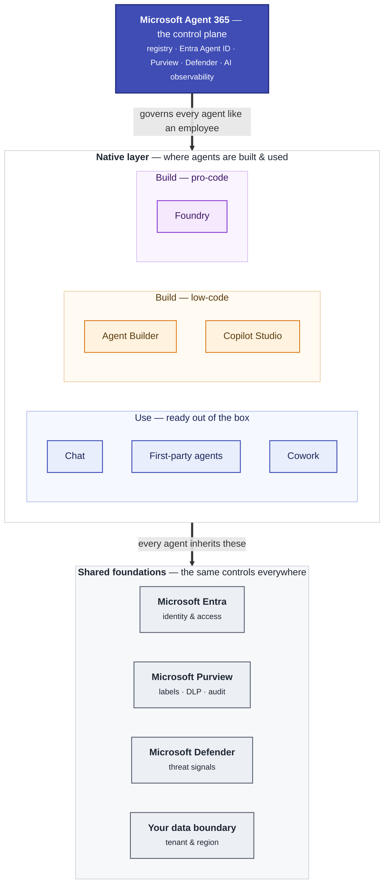

# Security & Governance

One question comes up the moment a team gets serious about agents: *"Is this safe, and who's in
control?"* The good news is that **security isn't something you bolt on** — every place you can build
or use a Copilot agent already comes with protection built in. This page explains that in plain
language, then shows how **Microsoft Agent 365** ties it all together into a single, governed estate.

!!! warning "Unofficial — verify against Microsoft docs"
    This is community guidance to help you reason about the *shape* of the controls — not a configuration
    runbook. Names, defaults, and capabilities evolve. Always confirm specifics against the linked
    Microsoft documentation before you make a governance decision.

---

## The two layers

Think of agent security as **two layers stacked on top of each other**:

1. **The native layer — what each environment protects on its own.** Whether you're chatting, using a
   first-party agent, or building in Copilot Studio or Foundry, that environment already enforces *who
   the agent is*, *what data it can touch*, and *where that data lives*.
2. **The control-plane layer — Agent 365.** This sits *above* all of them and gives admins one place to
   see, secure, and govern every agent as if it were a member of staff.

The two layers share the same foundations — **Microsoft Entra** for identity and **Microsoft Purview**
for data protection — so the controls feel consistent no matter where an agent lives.

---

## The native layer at a glance

Read each column as *"what this environment gives you out of the box."* The further right you go, the
more you're building and the more control (and responsibility) shifts to you.

| What it covers | Chat | First-party agents | Cowork | Agent Builder | Copilot Studio | Foundry |
| --- | --- | --- | --- | --- | --- | --- |
| **Who the agent acts as** | You — the signed-in user | You — in your session | You — your identity | You / the maker who shares it | Configurable — runs *as the user* or with its own connection | Its own app identity (managed identity) + Entra roles |
| **Where your data lives** | Microsoft 365 service boundary | Microsoft 365 boundary | Microsoft 365 boundary | Microsoft 365 boundary | Your Power Platform environment (region you pick) | Your own Azure resources, in your tenant |
| **What it can see** | Only what *you* can already open | Your existing permissions | Your existing permissions | Only sources the maker/user can access | Only the knowledge you connect | Only the data & tools you wire up; isolated per project |
| **Purview protection** | Full — labels, DLP, audit, retention | Inherits M365 Copilot protections | Full | Inherits M365 Copilot protections | Labels on SharePoint knowledge; maker audit; DLP via data policies | Governed as an "Enterprise AI app" |
| **How you govern it** | M365 admin center | M365 admin center → Integrated apps | M365 admin center | M365 admin center + Studio governance | Power Platform admin center + data policies | Azure RBAC + Azure policy |
| **Audit trail** | Purview audit log | Purview audit log | Purview audit log | Purview audit log | Purview + Microsoft Sentinel alerts | Azure Monitor + Purview |

!!! info "Three things that are true everywhere"
    - **An agent never sees more than the person using it.** Access is inherited from the user's existing
      permissions — it can't surface a file you couldn't already open.
    - **Your data stays yours.** Prompts and responses aren't used to train the underlying models.
    - **Sensitivity labels are honored.** If Purview encryption protects a file, the agent needs explicit
      rights to use it — the label travels with the data.

---

## What Agent 365 adds

The native layer keeps each environment safe *on its own*. The challenge for a large organization is
seeing the **whole fleet** of agents at once — who built them, what they can reach, and whether any are
behaving unexpectedly. That's the job of **Microsoft Agent 365**: a control plane that governs every
agent **the same way you'd govern an employee**.

- **A registry of every agent.** One inventory across Chat, Studio, Foundry, and beyond — no more shadow
  agents nobody is watching.
- **Each agent gets a real identity.** Through **Microsoft Entra Agent ID**, every agent instance has its
  own identity, owner, and ID — so it can be secured, audited, and offboarded like a user account.
- **One data-governance view.** **Microsoft Purview** treats an agent instance like a user: sensitivity
  labels, DLP, Insider Risk, eDiscovery, retention, and Communication Compliance all apply. Its **AI
  observability** view ranks every agent by risk (oversharing, data exfiltration, unusual behavior).
- **Threat protection.** Signals flow into **Microsoft Defender** so risky agent activity shows up
  alongside the rest of your security estate.

The story in one line: **each environment is secure on its own; Agent 365 lets you govern them all
together.**

!!! note "Evolving — verify before you rely on it"
    Agent 365 and Entra Agent ID are new and changing quickly. Treat the capabilities above as direction,
    confirm current behavior in the Microsoft docs, and watch the
    [What's New](../whats-new.md) page as this area matures.

---

## For admins — the detail behind each column

The collapsible sections below add the granular controls and link straight to the authoritative Microsoft
documentation. Champions can safely skip these; admins will want them.

??? note "Native controls, environment by environment"
    **Microsoft 365 Copilot (Chat · First-party agents · Cowork)**

    - Logical isolation per tenant via Entra authorization and RBAC; encryption at rest and in transit.
    - The **Semantic Index** honors each user's access boundary — it only reasons over content the user
      has at least view rights to.
    - Sensitivity labels are honored; for encrypted content the agent needs **VIEW + EXTRACT** usage
      rights. Data stays in the **Microsoft 365 service boundary**; **EU Data Boundary**, Advanced Data
      Residency, and Multi-Geo apply. Harmful-content filters plus jailbreak / cross-prompt-injection
      (XPIA) classifiers run on every interaction.
    - Admins control which agents are allowed in the **Microsoft 365 admin center → Integrated apps**.
    - Reference: [M365 Copilot data, privacy & security](https://learn.microsoft.com/en-us/copilot/microsoft-365/microsoft-365-copilot-privacy)
      · [Zero Trust for M365 Copilot](https://learn.microsoft.com/en-us/security/zero-trust/zero-trust-microsoft-365-copilot)

    **Copilot Studio**

    - Agents live in **Power Platform environments**; environment routing keeps makers in a safe space.
    - **Power Platform data policies (DLP)** govern maker & user authentication, knowledge sources,
      actions / connectors / skills, HTTP requests, channel publication, App Insights, and triggers
      (autonomous-agent guardrails against data exfiltration).
    - User authentication via Entra ID manual auth, including a certificate provider; maker audit logs in
      **Microsoft Purview**; agent-activity alerts in **Microsoft Sentinel**; sensitivity labels surfaced
      for SharePoint knowledge; **customer-managed keys (CMK)** and **Customer Lockbox** supported; a
      pre-publish security scan warns makers of risky configurations.
    - Reference: [Copilot Studio security & governance](https://learn.microsoft.com/en-us/microsoft-copilot-studio/security-and-governance)

    **Foundry**

    - **Microsoft Entra ID authentication + Azure RBAC** (preferred over key auth), with least-privilege
      built-in roles (Foundry User / Project Manager / Account Owner / Owner), custom roles, and PIM for
      just-in-time access.
    - The **standard agent setup** uses your own single-tenant Azure resources — Storage, Cosmos DB, AI
      Search, and Key Vault — so all agent data stays in **your** tenant, isolated per project. System and
      user-assigned **managed identities** give agents scoped access to those resources.
    - Reference: [Foundry RBAC](https://learn.microsoft.com/en-us/azure/ai-foundry/concepts/rbac-azure-ai-foundry)
      · [Standard agent setup](https://learn.microsoft.com/en-us/azure/ai-foundry/agents/concepts/standard-agent-setup)

??? note "The Agent 365 control plane, in detail"
    - **Identity — Microsoft Entra Agent ID.** Every agent instance is a first-class identity with an
      Entra-enabled status, an owner, and an agent user ID — so it can be governed, conditional-access
      gated, and offboarded like any account. Root: [Entra Agent ID](https://learn.microsoft.com/en-us/entra/agent-id/).
    - **Access — Microsoft Entra.** Conditional Access, Privileged Identity Management (JIT), Entitlement
      Management, and Lifecycle Workflows apply Zero Trust to AI usage and the nonhuman identities behind
      agents. Reference: [Secure generative AI with Microsoft Entra](https://learn.microsoft.com/en-us/entra/architecture/secure-generative-ai).
    - **Data — Microsoft Purview.** Purview governs an agent instance *as a user*. Supported for Agent
      365: DSPM / DSPM for AI, Auditing (agent-to-human, human-to-agent, agent-to-tools, agent-to-agent),
      Data classification, Sensitivity labels, DLP, Insider Risk Management, Communication Compliance,
      eDiscovery, Data Lifecycle Management, and Compliance Manager. The **DSPM → AI observability** view
      ranks agents by risk and recommends remediation. Reference:
      [Purview for Agent 365](https://learn.microsoft.com/en-us/purview/ai-agent-365)
      · [Purview for generative AI](https://learn.microsoft.com/en-us/purview/ai-microsoft-purview).
    - **Threats — Microsoft Defender.** Insider Risk signals and agent activity integrate into Defender
      XDR for a single security view.

---

## Where this leads

Security isn't a stage you finish — it's a thread that runs through the whole journey. As you climb the
ladder, the controls deepen with you:

- **Just getting started?** The native protections above already cover you in [Stage 1 · Chat](../stages/stage-1-chat.md)
  and [Stage 2 · First-Party Agents](../stages/stage-2-first-party.md) — nothing to configure.
- **Building shareable agents?** Governance shifts toward makers and environments in
  [Stage 4 · Agent Builder](../stages/stage-4-agent-builder.md) and [Stage 6 · Copilot Studio](../stages/stage-6-studio.md).
- **Running production agents at scale?** That's where **Foundry** and the **Agent 365** control plane
  earn their keep — full tenant isolation plus org-wide governance.

> **📚 Learn more.**
>
> - [Microsoft Purview for AI](https://learn.microsoft.com/en-us/purview/ai-microsoft-purview) — the data-governance front door (DSPM for AI).
> - [Secure generative AI with Microsoft Entra](https://learn.microsoft.com/en-us/entra/architecture/secure-generative-ai) — identity & access for AI.
> - [Copilot Studio security & governance](https://learn.microsoft.com/en-us/microsoft-copilot-studio/security-and-governance) — maker-environment controls.
