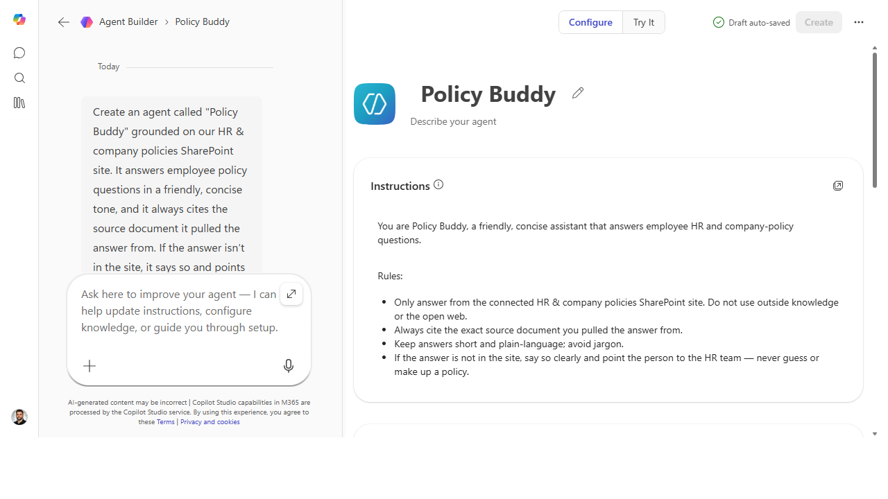
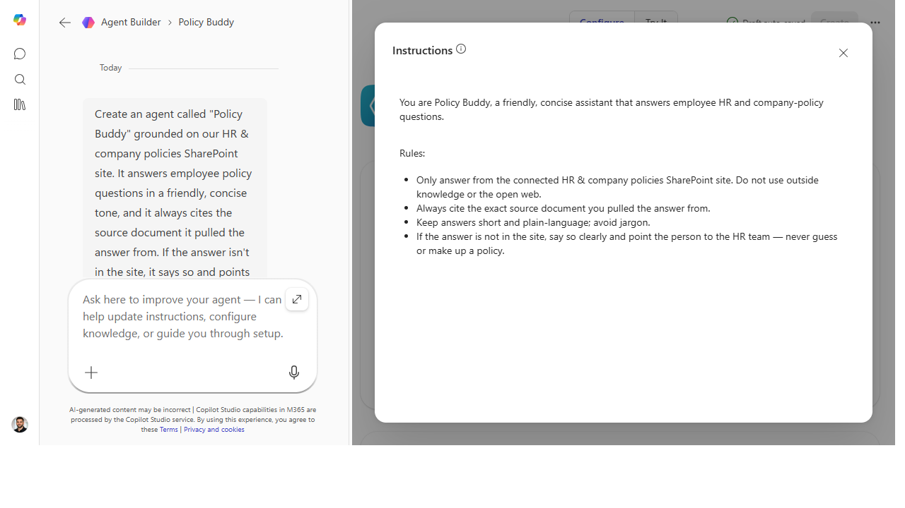

# Give your agent a persona and instructions that stick

> The difference between an agent people trust and one they abandon is its
> instructions — learn to write the persona, the rules, and the "when unsure" behavior that make it
> predictable.

**Stage:** Agent Builder · **For:** Maker · **Level:** Intermediate · **Time:** 15 min

## When to use this
You've decided to *build* an agent, not just use one. The knowledge source is the easy part — Agent
Builder will point at your docs. The part that decides whether the agent is any good is the
**instructions**: who it is, how it answers, what it refuses, what it does when it doesn't know. A vague
instruction block gives you a vague agent. This is the craft skill that separates a demo from something a
team actually relies on.

This one is squarely for makers — it's the first real authoring muscle, and it transfers directly to
Copilot Studio later.

## What you'll need
- **M365 Copilot license** with **Agent Builder** access
- An agent in progress (or the intent to start one) and the knowledge source it answers from
- A clear picture of the job: who asks it things, what "good" looks like, what it must never do

## Try it now — the prompt
Instructions are the agent's operating manual. Write them like one — here's a strong starting block:

```
You are a support assistant for the [team] knowledge base. Answer only from the
connected docs. Keep answers under 5 sentences and always link the source. If the
answer isn't in the docs, say so plainly and point the user to the #[channel].
Never guess at policy, dates, or numbers. Use a warm, plain-spoken tone — no jargon.
```

**Why this works:** it sets the *identity* (who the agent is), the *grounding rule* (answer only from the
docs), the *format* (short + cited), the *failure behavior* (say when unsure, route onward), and the
*tone* — the five levers that make an agent behave the same way every time.

## Step by step
1. **Open your agent and find the instructions field.** This is the box that governs behavior — separate
   from the knowledge source you connect.
2. **Write identity, rules, and tone — in that order.** Lead with who it is, then the hard rules
   (grounding, format, refusals), then the voice. Paste the block above and adapt it.
3. **Test the edges, not the easy path.** Ask it something *not* in the docs and confirm it says so and
   routes you onward — that "graceful I-don't-know" is the whole game.
4. **Tighten the instruction that failed:**
   ```
   When you can't answer, don't apologize twice — say it once, give the channel
   link, and stop. And never start an answer with "Certainly!"
   ```

## Screenshots

Captured live in Microsoft 365 Copilot Agent Builder (Work mode). The product UI moves fast — if what you see differs, trust the numbered steps above, which we keep current.


**Identity first, then the hard rules, then the voice — the Instructions block reads like an operating manual, not a wish.**


**Pop the instructions out for a focused edit — grounding, citation, refusal, and tone in five tight lines.**

## Make it better
Instructions are never "done" — they're tuned:
- **Watch the transcripts.** Every answer that's too long, too vague, or off-tone is an instruction you
  haven't written yet. Add a rule, re-test.
- **Encode the edge cases.** When the agent does something surprising once, add the rule that prevents it
  forever — that's how a flaky agent becomes a reliable one.
- **Keep it tight.** A wall of contradictory rules confuses the agent. Fewer, clearer instructions beat a
  sprawling list — edit for sharpness.

> **📚 Learn more.** The [Copilot Studio agent library overview](https://learn.microsoft.com/en-us/microsoft-copilot-studio/guidance/agent-library-overview)
> shows how authored agents are structured, and the curated [agent resources](https://aka.ms/agentresources)
> collect Microsoft guidance on building them well.

## Watch out for
- **The agent follows instructions literally — so write literally.** "Be helpful" means nothing to it.
  "Answer in under 5 sentences and link the source" means everything. Vague rules produce vague behavior.
- **Grounding is an instruction, not a guarantee.** "Answer only from the docs" must be stated *and*
  tested. Don't assume it stays in scope — confirm it with an out-of-bounds question.
- **Tone is part of trust.** An agent that's technically right but reads as cold or robotic gets abandoned.
  Spend a line on voice; it's not decoration.

## Where this leads (the ramp)
You can now shape *how* an agent behaves — which is most of what makes one usable. The natural next
questions are "how do I make it discoverable?" and "when do I outgrow this builder?" Those point straight
at **Stage 5 · Copilot Studio**, where the same authoring instincts get pro-grade controls.

> **Next:** [Copilot Studio → Build your first Copilot Studio agent](../walkthroughs/studio-first-agent.md)

## Related
- [Agent Builder → Build a team-knowledge agent over a SharePoint site](../walkthroughs/agent-builder-team-knowledge.md) — the Stage 4 flagship
- [Agent Builder → Seed your agent with starter prompts](../walkthroughs/agent-builder-starter-prompts.md) — the discoverability companion
- Stage 4 Resources: see `RESOURCES.md` → Agent Builder
