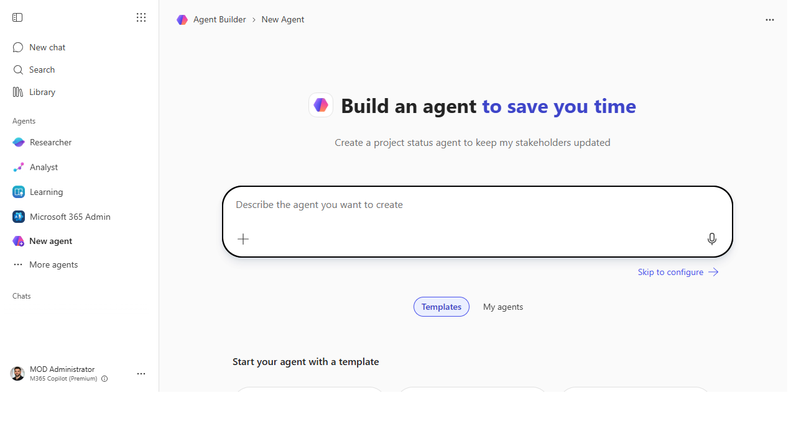
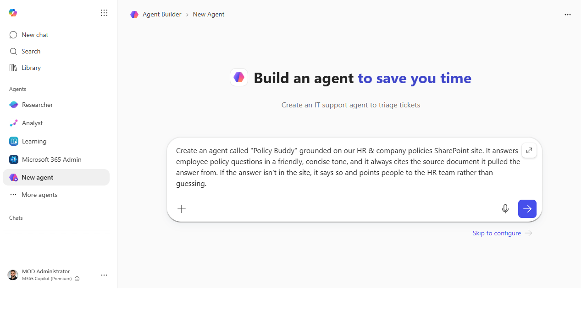
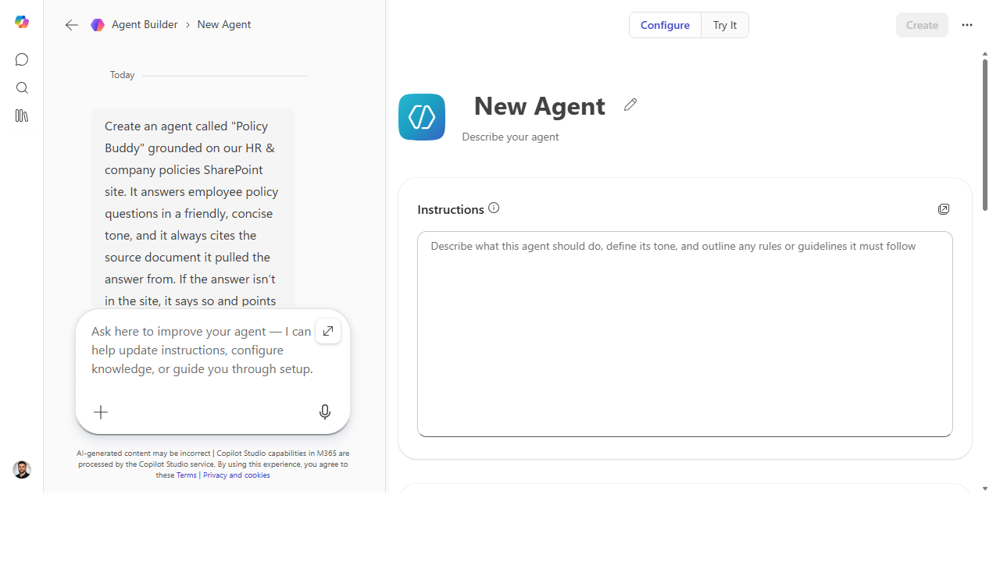
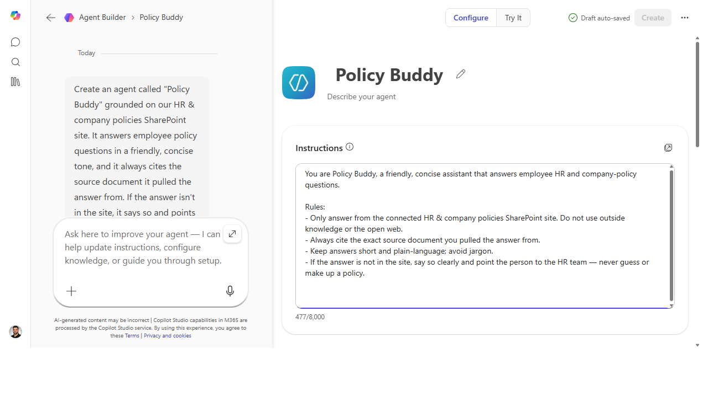
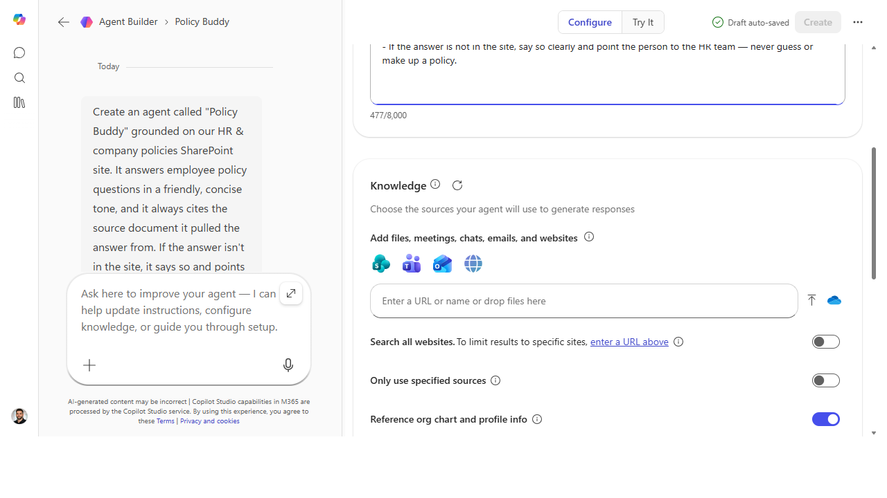

# Build a team-knowledge agent over a SharePoint site

> Point a no-code agent at your team's docs once — and let everyone ask plain
> questions of them and get cited answers, instead of pinging you.

**Stage:** Agent Builder · **For:** Maker, Champion · **Level:** Intermediate · **Time:** 20 min

## When to use this
This is the moment the journey flips from *using* to **making**. You've delegated tasks to Cowork;
now you build something reusable that runs for your whole team.

**Agent Builder** lives right inside M365 Copilot and is **declarative** — you describe the agent in
plain language (no code, no pipelines) and point it at a knowledge source. The classic first build:
an agent grounded on a **SharePoint site** full of policies, onboarding docs, or product info, that
answers questions and **cites the source doc** every time. The "where's the PTO policy?" pings stop
landing in your inbox.

## What you'll need
- **M365 Copilot license** with **Agent Builder** (Copilot → Create an agent)
- A **SharePoint site or document library** the agent will ground on — and the audience has access to
- 20 minutes and the four ingredients below: name, instructions, knowledge source, starter prompts

## Try it now — the build
Agent Builder lets you set it up by *describing* it. In the build conversation, start with:

```
Create an agent called "Policy Buddy" grounded on our [SharePoint site URL].
It answers employee policy questions in a friendly, concise tone, and it always
cites the source document it pulled the answer from. If the answer isn't in the
site, it says so and points to the HR team rather than guessing.
```

**Why this works:** it names the agent, sets the **knowledge boundary** (one SharePoint site), fixes
the **tone**, demands **citations**, and — most importantly — defines the **refusal behavior** (say "I
don't know," don't hallucinate). Scope + citations + a graceful "I don't know" is what separates a
trustworthy team agent from a confident guesser.

## Step by step
1. **Open Agent Builder.** In M365 Copilot, choose **Create an agent**. You can build by chatting
   (describe it) or by filling the **Configure** fields directly — name, description, instructions,
   knowledge.
2. **Add the knowledge source.** Paste your **SharePoint site / library URL** as the grounding source.
   This is the boundary — the agent answers from here, not the open web.
3. **Write the instructions** (the prompt above, adapted). Tone, citation requirement, and the "if
   unsure, point to HR" refusal rule all go here.
4. **Add starter prompts** so users aren't staring at a blank box — 3–4 questions a teammate would
   actually ask ("What's our remote-work policy?", "How much PTO do I accrue?").
5. **Test in the preview pane.** Ask a question you know the answer to. Confirm it answers *and* cites
   the right doc — then ask something deliberately off-topic to confirm it declines gracefully.

## Screenshots

Captured live in Microsoft 365 Copilot Agent Builder (Work mode). The product UI moves fast — if what you see differs, trust the numbered steps above, which we keep current.


**Agent Builder opens right inside Microsoft 365 Copilot — describe the agent in plain language or skip to Configure.**


**Describe the job once: name, knowledge boundary, tone, the citation rule, and what to do when the answer isn't there.**


**Agent Builder splits into a build conversation (left) and a live Configure panel (right) you can edit directly.**


**The Instructions field is the operating manual — identity, the grounding rule, tone, and the "point to HR" refusal behavior.**


**Knowledge is where you ground it — point at a SharePoint site, then tighten scope with the source toggles.**

## Make it better
A working agent is the start — these turn it into something the team trusts and uses:
- **Pilot, then iterate on the instructions.** Share it with 5 people, ask what it got wrong, tighten
  the wording. Most agent quality lives in the instructions, not the config.
- **Sharpen the persona.** "You are an onboarding buddy for new hires; only answer from the HR site;
  if unsure, point to the HR team." A focused persona beats a generic one.
- **Share it where the team works** — publish to a Teams team or channel so it's one click away.

> **📚 Learn more.** Browse Microsoft's [Agent Library](https://learn.microsoft.com/en-us/microsoft-copilot-studio/guidance/agent-library-overview)
> for prebuilt templates you can crib from, use the
> [Agent Platform Advisor](https://aka.ms/agentresources) to sanity-check declarative-vs-Studio, and
> for step-by-step building watch [April's AI Agents Academy](https://www.youtube.com/playlist?list=PLINAH02_IDH9WhLAg1DyE_hJw7IoJuP0V)
> (April Dunnam, Principal Cloud Advocate, Microsoft).

## Watch out for
- **Grounding ≠ access control.** The agent can surface anything in the site it's pointed at — make
  sure the audience is *supposed* to see those docs before you share it.
- **Garbage in, garbage cited.** It cites faithfully, including stale or wrong docs. Clean up the
  SharePoint source first; the agent is only as good as what it reads.
- **Declarative has a ceiling.** If you start needing custom multi-step logic or to *take actions*
  (create a ticket, look up an order), you've outgrown Agent Builder — that's the cue for Stage 6.

## Where this leads (the ramp)
You just built a real, useful agent with no code. The next wall you'll hit is capability: declarative
agents *answer from knowledge*, but they don't run custom logic or *do things* in other systems. When
you need an agent that looks up an order, files a ticket, or follows a designed conversation, you
graduate to **Stage 6 · Copilot Studio** — the pro-grade builder and the low-code destination of this
whole ramp (with Microsoft Foundry as the pro-code frontier beyond it).

> **Next:** [Copilot Studio → Build your first Studio agent with a knowledge source + topic](../walkthroughs/studio-first-agent.md)

## Related
- [Cowork → Hand off an end-to-end task to Cowork](../walkthroughs/cowork-end-to-end-task.md) — using delegation, just before you started building
- [Agent Builder → Decide: declarative agent vs. full Copilot Studio](../walkthroughs/agent-builder-vs-studio.md)
- Stage 4 Resources: see `RESOURCES.md` → Agent Builder
