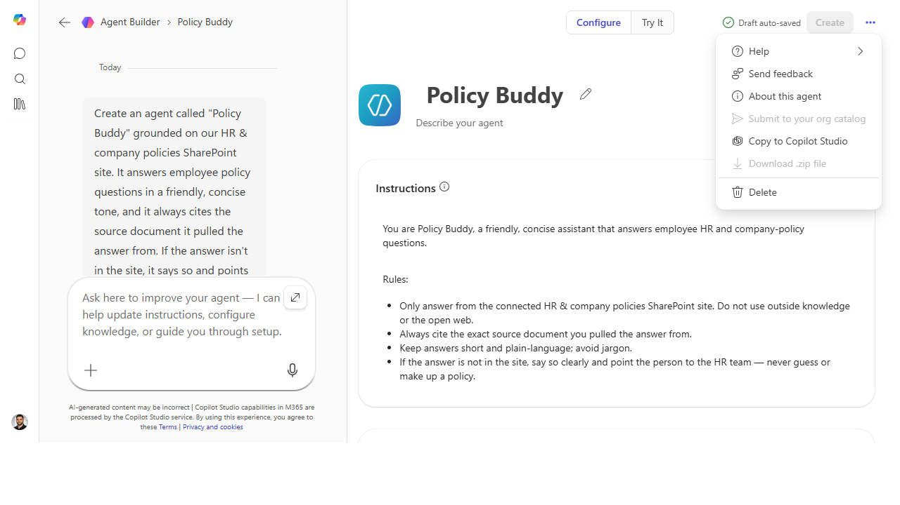

# Know when to graduate from Agent Builder to Copilot Studio

> Agent Builder is the fast on-ramp; Copilot Studio is the highway — this is the
> honest decision guide for when you've outgrown one and need the other, so you don't rebuild twice.

**Stage:** Agent Builder · **For:** Maker, IT/Admin · **Level:** Intermediate · **Time:** 10 min

## When to use this
You've built a few agents in Agent Builder and you're starting to hit walls — you want a real connector to
a line-of-business system, multi-step logic, environment controls, or usage analytics, and the lightweight
builder just doesn't go there. The instinct is to push the simple tool further than it's meant to go. The
better move is to recognize the graduation moment and step up to **Copilot Studio** deliberately. This page
is the decision, not a feature dump.

It's a shared call: makers feel the capability ceiling; IT/admins own the governance and licensing that
come with the more powerful tool.

## What you'll need
- **M365 Copilot license** (and, for the build itself later, Copilot Studio access)
- One or more agents you've already built in Agent Builder — real experience with its limits
- Clarity on the *job to be done*, because the right tool depends on what the agent actually needs to do

## Try it now — the prompt
You can use Copilot itself to pressure-test the decision. Describe the agent and ask for the honest call:

```
Here's what my agent needs to do: [describe the job, the data sources, and the
logic]. Tell me honestly whether Agent Builder can do this or whether I should
build it in Copilot Studio — and name the specific capability that decides it.
```

**Why this works:** it forces the decision down to a *specific capability* (a connector, branching logic,
publishing scope) rather than a vague "which is better," so you get a reason you can act on — not a
preference.

## Step by step
1. **List what your agent can't do today.** Write the concrete wall you hit in Agent Builder — "needs to
   write back to our ticketing system," "needs different answers by region."
2. **Match each need to the right tool.** Knowledge-grounded Q&A over M365 content → Agent Builder is fine.
   Connectors, multi-step actions, environments, analytics → Copilot Studio.
3. **Decide before you build, not after.** The expensive mistake is building twice. If the job clearly
   needs Studio-class capability, start there — don't prototype into a dead end.
4. **Sanity-check the governance side with IT:**
   ```
   Draft the questions IT will ask before I publish a Studio agent — licensing,
   environment, data access, and who owns it after launch.
   ```

## Screenshots

Captured live in Microsoft 365 Copilot Agent Builder (Work mode). The product UI moves fast — if what you see differs, trust the numbered steps above, which we keep current.


**The graduation path is built in — when you outgrow the lightweight builder, "Copy to Copilot Studio" carries the agent into the pro-grade tool so you don't rebuild from scratch.**

## Make it better
The decision sharpens with reps:
- **Keep a "graduation log."** Note each time an agent outgrew the builder and why — over time it becomes
  your team's own rule of thumb for where to start.
- **Don't over-graduate.** Plenty of valuable agents never need Studio. If Agent Builder does the job,
  shipping there is the *right* call, not a lesser one — match the tool to the need.
- **Bring IT in early.** The governance conversation is easier before a build than after. Loop them in at
  the decision, not at the publish button.

> **📚 Learn more.** The [Copilot Studio agent library overview](https://learn.microsoft.com/en-us/microsoft-copilot-studio/guidance/agent-library-overview)
> shows what the more powerful tool offers, and the [Copilot Studio resources hub](https://aka.ms/copilotstudio/resources)
> collects the guidance you'll want before you commit to building there.

## Watch out for
- **"Powerful" isn't "right."** Reaching for Studio when Agent Builder would do adds cost, governance, and
  maintenance you don't need. The goal is the simplest tool that does the job — not the biggest.
- **Rebuilding is the real cost.** The reason to decide early is that migrating a half-built agent is
  painful. Name the deciding capability up front and pick once.
- **Governance is a gate, not an afterthought.** A Studio agent touches more — connectors, data,
  environments. IT's questions aren't bureaucracy; they're what keeps a published agent safe.

## Where this leads (the ramp)
This is the hinge of the whole journey. You've gone from *using* Copilot to *building* lightweight agents,
and you've just learned to recognize when the job demands the pro-grade tool. That tool — and the
destination this entire ramp has been climbing toward — is **Stage 6 · Copilot Studio**.

> **Next:** [Copilot Studio → Build your first Copilot Studio agent](../walkthroughs/studio-first-agent.md)

## Related
- [Agent Builder → Build a team-knowledge agent over a SharePoint site](../walkthroughs/agent-builder-team-knowledge.md) — the Stage 4 flagship
- [Copilot Studio → Build your first Copilot Studio agent](../walkthroughs/studio-first-agent.md) — the low-code destination this decision leads to
- Stage 4 Resources: see `RESOURCES.md` → Agent Builder
