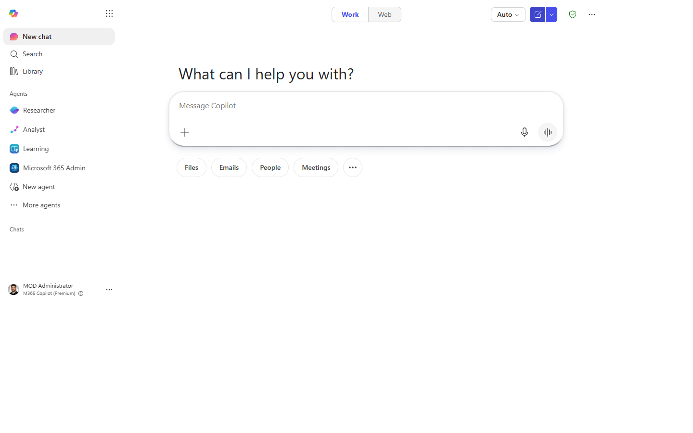
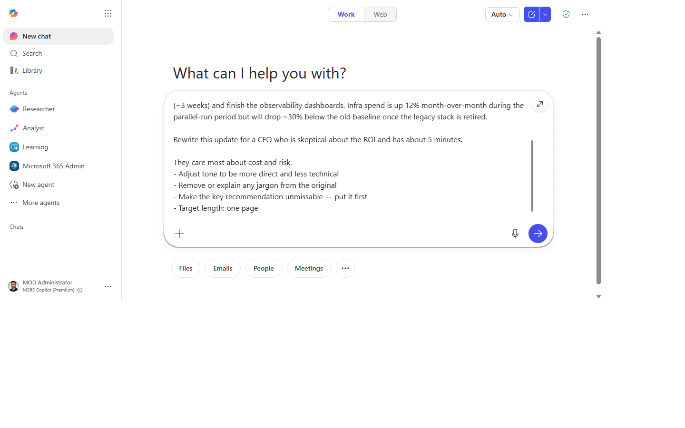
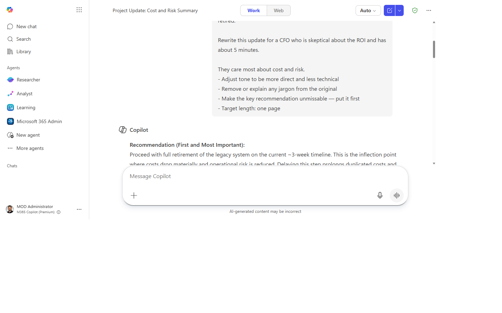
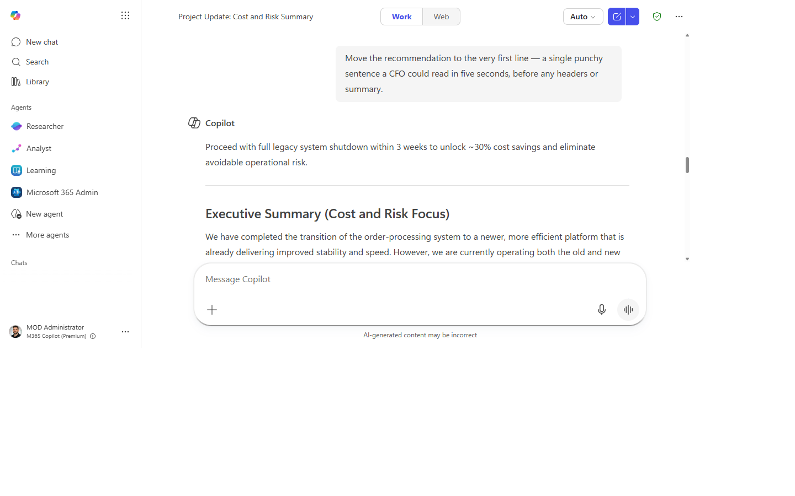
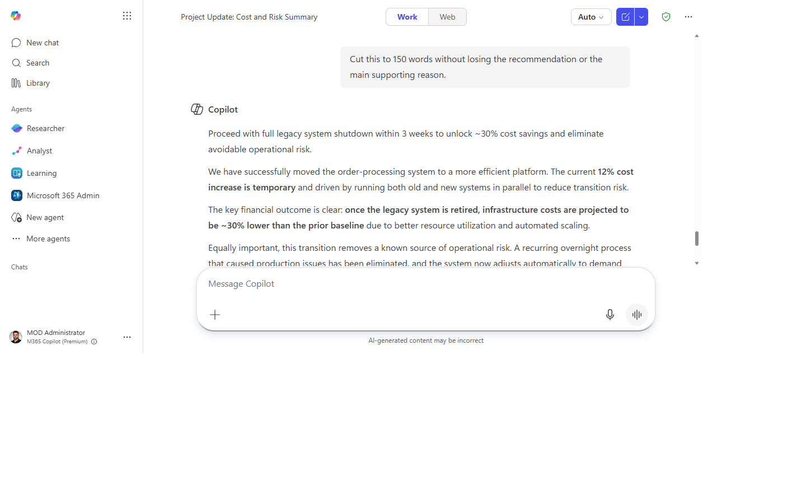

# Adapt a document or message for a different audience

> Transform any piece of content for a new audience in one prompt — no rewriting from scratch, no second-guessing the tone.

**Stage:** Copilot Chat · **For:** End user, Manager · **Level:** Intermediate · **Time:** 10 min · **Saves:** ~15 min vs. manual

## When to use this

You have content that was written for one audience but needs to land with another. A technical spec that needs to become an exec summary. A US-focused document that needs to work for a global team. A detailed report that needs to become a three-bullet Slack message for a VP who reads on a phone.

Copilot adapts the tone, vocabulary, length, and emphasis in a single pass — preserving the substance while restructuring the framing for the new reader.

## What you'll need

- **M365 Copilot license** — Copilot in Word, Outlook, or Microsoft 365 Copilot Chat
- The original document or message
- A clear sense of who the new audience is and what they care about most

## Try it now — the prompt

Paste the source content into Microsoft 365 Copilot Chat (or use Copilot in Word), then:

```
Rewrite this [document / email / summary] for [target audience].

They care most about [outcome — e.g., cost and risk / speed to market / compliance].
- Adjust tone to be [more direct / less technical / more formal / more conversational]
- Remove or explain any jargon from the original
- Make the key ask or recommendation unmissable — put it first
- Target length: [3 bullet points / one page / 200 words]
```

**Why this prompt works:** Naming what the audience *cares about* shifts the emphasis, not just the vocabulary. The explicit tone instruction prevents Copilot from defaulting to its own style judgment. Putting the ask first is almost always right for busy audiences.

## Step by step

1. **Paste the original content** into Microsoft 365 Copilot Chat or open it in Word and invoke Copilot.
2. **Fill in the prompt.** The more specific the audience and outcome, the sharper the result.
   - Generic: `"for executives"`
   - Better: `"for a CFO who is skeptical about the ROI and has 5 minutes"`
3. **Check the lead.** Is the key ask in the first sentence? If not, ask: `"Move the recommendation to the very first line."`
4. **Check for leftover jargon.** Skim for acronyms or technical terms and ask: `"Simplify [term] for someone who doesn't work in [domain]."`
5. **Run a length check.** If the output is still too long: `"Cut this to [word count] without losing the recommendation or the main supporting reason."`

## Screenshots

Captured live in Microsoft 365 Copilot Chat (Work mode). The product UI moves fast — if what you see differs, trust the numbered steps above, which we keep current.

**1. Original content ready.** Copilot Chat open with the source document or message pasted in.


**2. Prompt entered.** The adapt-for-audience prompt typed in with audience, outcome, tone, and length.


**3. Adapted version.** The content rewritten for the new audience with the ask up front.


**4. Recommendation first.** The key ask moved to the very first line.


**5. Length trimmed.** Cut to the target length without losing the recommendation or main reason.


## Tips and variants

- **Side-by-side comparison:** ask Copilot to produce a table with the original version vs. adapted version so you can see exactly what changed.
- **Multiple audiences at once:** `"Give me two versions: one for the engineering team and one for the product exec."` — useful for all-hands comms.
- **International adaptation:** add `"Avoid US-centric idioms and cultural references. This will be read by a global audience."` for cross-region content.
- **Email subject line:** after adapting the body, ask: `"Write three subject line options for this email, each under 8 words."`

## Next:

[:octicons-arrow-right-24: Rewrite an email for a tougher audience](chat-rewrite-email.md)
