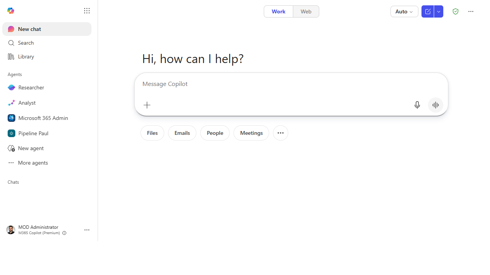
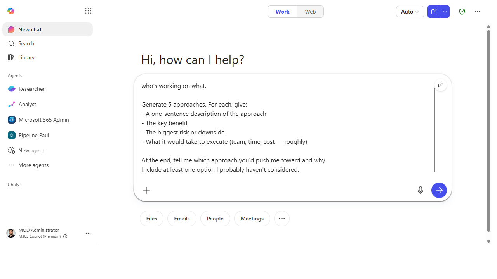
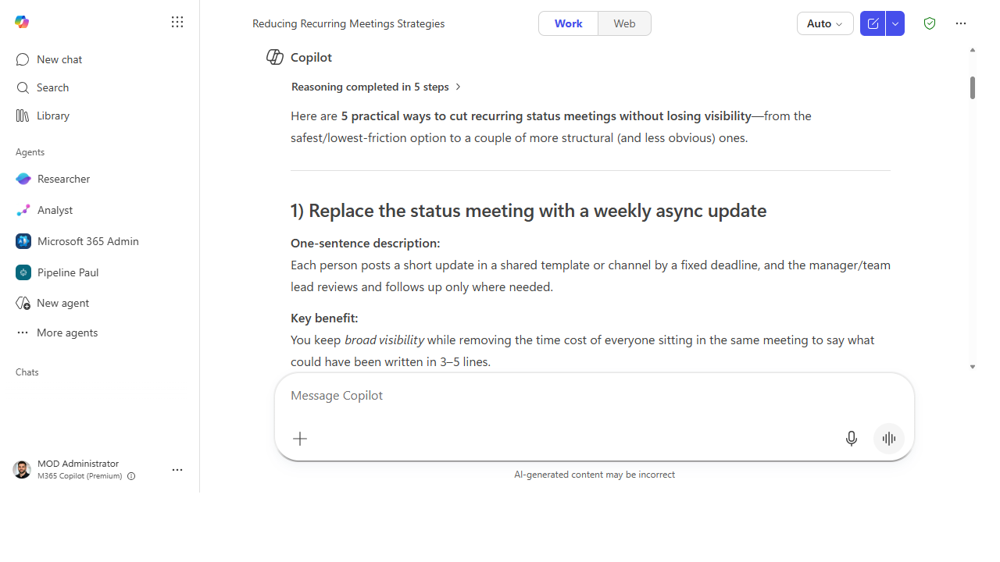
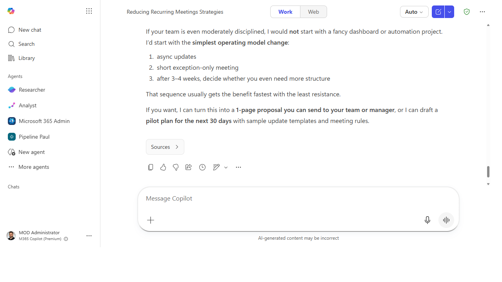

# Brainstorm solutions with structured tradeoffs

> Get past the blank page instantly — Copilot generates structured options with honest tradeoffs so you can make a faster, better-informed decision.

**Stage:** Copilot Chat · **For:** End user, Manager · **Level:** Intermediate · **Time:** 10 min · **Saves:** ~20 min vs. manual

## When to use this

You're stuck on a problem: how to handle a difficult stakeholder situation, how to structure a new process, how to respond to a budget cut, or how to approach a technical decision. You want options — but not just a dump of vague ideas. You need them structured, with tradeoffs, so you can actually choose.

This prompt forces Copilot past generic "here are some ideas" mode into structured analysis that includes what each option costs you and one counterintuitive option you probably haven't considered.

## What you'll need

- **M365 Copilot license** — Microsoft 365 Copilot Chat
- A clear problem statement (one sentence is enough to start)

## Try it now — the prompt

Open Microsoft 365 Copilot Chat and paste:

```
I'm trying to [problem statement — be specific].

Generate 5 approaches. For each, give:
- A one-sentence description of the approach
- The key benefit
- The biggest risk or downside
- What it would take to execute (team, time, cost — roughly)

At the end, tell me which approach you'd push me toward and why.
Include at least one option I probably haven't considered.
```

**Why this prompt works:** The structure requirement ("for each, give…") prevents vague output. Asking for "what it would take" surfaces execution reality. The "push me toward" instruction forces a recommendation rather than a hedge. "One option I probably haven't considered" reliably produces a counterintuitive angle worth examining.

## Step by step

1. **Write a tight problem statement.** The more specific you are, the better the options. Compare:
   - Vague: `"How do I improve team collaboration?"`
   - Better: `"My team misses deadlines because people don't know who owns what. How do I fix that?"`
2. **Run the prompt.** Read all 5 options before reacting.
3. **Stress-test the recommendation.** Ask:
   ```
   What's the strongest argument *against* the option you recommended?
   ```
4. **Go deeper on one option.** Pick the one that resonates most and ask:
   ```
   Give me a concrete first step for [option] — something I could do this week.
   ```
5. **Share for input.** Paste the options table into a Teams message or a Copilot Page and ask colleagues to weigh in before you decide.

## Screenshots

Captured live in Microsoft 365 Copilot Chat (Work mode). The product UI moves fast — if what you see differs, trust the numbered steps above, which we keep current.

**1. Open Microsoft 365 Copilot Chat and start a new chat.**



**2. Paste the structured brainstorm prompt into the composer.**



**3. Copilot returns five approaches — each with a one-sentence description, the key benefit, the biggest risk, and a rough cost to execute.**



**4. It closes with a clear recommendation and offers to turn the pick into a one-page proposal or a 30-day pilot plan.**



## Make it better

- **For decisions with stakeholders:** add `"Also flag which option is most likely to face resistance from [stakeholder type], and why."` to the prompt.
- **For technical decisions:** replace "team, time, cost" with "technical complexity, dependencies, and reversibility."
- **Quick version:** ask for 3 options with just benefit + risk if you need speed over depth.
- **Expand to a decision brief:** after picking an option, ask Copilot to draft a one-page decision brief you can share for sign-off.

## Watch out for

- **The five options can sound more distinct than they are.** Watch for the same idea dressed up three different ways.
- **The recommendation reflects how you framed the problem, not independent judgment.** A biased prompt yields a biased pick.
- **Risk and cost estimates are rough by design.** Treat them as conversation starters, not numbers to plan against.

## Where this leads (the ramp)

Once you're running structured brainstorms regularly, you'll want the strongest option to survive past the chat window. The first-party Idea Coach agent takes a raw brainstorm and shapes it into a sponsor-ready proposal — no copy-paste required.

> **Next:** [Idea Coach: turn a brainstorm into a proposal](first-party-idea-coach-proposal.md)

## Related

- [Build a first-draft project plan for your chosen approach](chat-project-plan.md)
