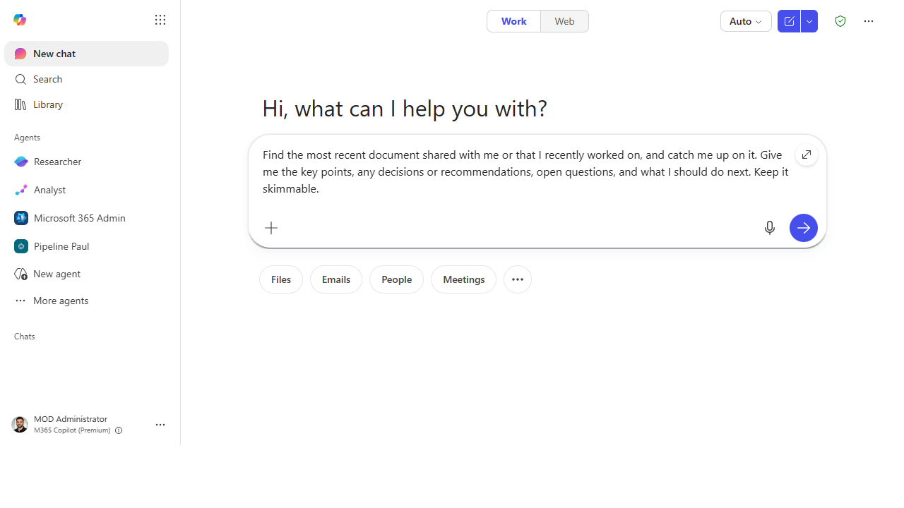
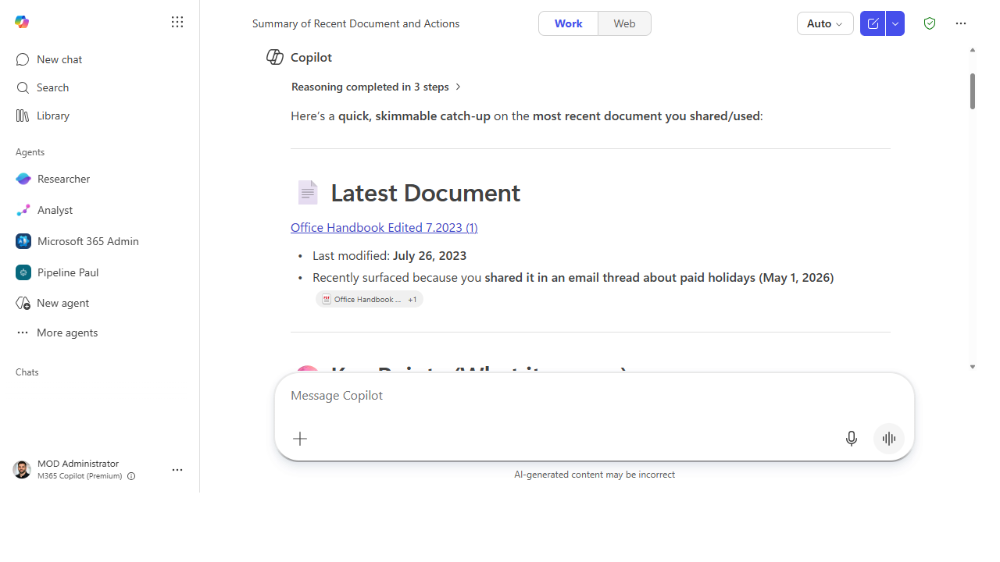

# Get up to speed on a long document fast

> A 30-page document reduced to the handful of things *your* role actually needs to
> know — plus the risks hiding on page 22 — before the meeting where everyone pretends they read it.

**Stage:** Copilot Chat · **For:** End user, Manager · **Level:** Starter · **Time:** 3 min · **Saves:** ~20 min vs. manual

## When to use this
Someone drops a long spec, contract, strategy doc, or research report in your lap and the review is
tomorrow. Reading it cover to cover isn't realistic, and a generic "summarize this" gives you a bland
abstract that helps no one. The move is to ask Copilot to summarize the document *through the lens of
your role* — so a sales engineer, a finance lead, and a lawyer each get a different, useful three
bullets from the same file.

This is the fastest way to turn "I haven't read it" into "I know the three things that matter and the
one thing I'd push back on."

## What you'll need
- **M365 Copilot license** (Copilot in Word, Teams, or the Copilot app)
- The document open or referenced — a Word doc, PDF, or anything Copilot can read in your tenant
- A clear sense of *your* angle (the role or decision you're reading it for)

## Try it now — the prompt
Open the document, open Copilot, and frame the summary around your role:

```
Summarize this document for a [sales engineer]. Give me the 3 things I most need to
know, anything that affects a customer commitment, and any risks or open questions
I should raise. Skip the background — assume I know the basics.
```

!!! example "Filled in — a solutions architect reviewing a security whitepaper"
    ```
    Summarize this document for a solutions architect. Give me the 3 things I most need to
    know, anything that could affect a production deployment commitment, and any risks or
    open questions I should raise with the customer. Skip the background — assume I know the basics.
    ```

**Why this works:** the role tag (*for a sales engineer*) and the "what matters to me" framing (*affects
a customer commitment*) turn a flat summary into a filtered one. You're telling Copilot which 5% of the
document is signal for you and asking it to throw away the rest.

## Step by step

> **Microsoft how-to:** [Catch up on work quickly using Microsoft 365 Copilot Chat](https://support.microsoft.com/en-us/topic/catch-up-on-work-quickly-using-microsoft-365-copilot-chat-cffb11c2-bb06-4d5b-bd4b-9497895daff3) — the official step-by-step from Microsoft Support.

1. **Open the document and launch Copilot.** In Word, use the Copilot pane; elsewhere, reference the
   file from the Copilot app or Teams.
2. **Paste the role-framed prompt.** Copilot reads the whole file and returns the role-specific
   essentials, the commitments, and the risks.
3. **Spot-check the risks against the source.** Risks and commitments are the high-stakes claims — open
   the cited section and confirm the document really says it before you repeat it.
4. **Drill into whatever you'll be asked about:**
   ```
   Pull every deadline and dollar figure from this doc into a table, and flag any
   that conflict with each other.
   ```

## Screenshots

Captured live in Microsoft 365 Copilot Chat (Work mode). The product UI moves fast — if what you see differs, trust the numbered steps above, which we keep current.


**Point it at the document.** Ask for key points, decisions, open questions, and your next step.


**Get a grounded catch-up.** Copilot names the real file, cites it, and pulls out what matters — so you skim, not read.

## Make it better
Same document, sharper asks:
- **Compare it to what you knew.** "How does this differ from the version we reviewed last quarter?"
  surfaces what actually changed.
- **Prep your contribution.** "Draft three questions I could ask in the review that would add value."
- **Translate the jargon.** "Explain section 4 like I'm not an expert in [domain]" — great for docs that
  cross into a team that isn't yours.

## Watch out for
- **A summary is not the document.** For anything you'll sign, commit to, or be held to, read the actual
  clause — don't act on the summary alone.
- **It compresses, which means it drops nuance.** Caveats, conditions, and "except when…" language are
  exactly what summaries flatten. If the stakes are high, verify the fine print.
- **Garbage in, garbage out.** If the source doc is a scanned image or badly formatted, the read quality
  drops. Confirm Copilot actually parsed the whole thing before you trust the gaps.

## Where this leads (the ramp)
Summarizing one document you were handed is step one. The next instinct is *"don't just read me this
one — go find everything on this topic and build me the picture."* That's **Stage 2's Researcher**: it
pulls from many sources, your files and the web, and assembles a cited brief instead of a single-file
summary.

> **Next:** [First-Party Agents → Deep-dive a topic with Researcher](../walkthroughs/first-party-researcher-deep-dive.md)

## Related
- [Chat → Turn a meeting into tracked follow-ups](../walkthroughs/chat-meeting-followups.md) — the Stage 1 flagship
- [Chat → Prep for a 1:1 in two minutes](../walkthroughs/chat-prep-1on1.md) — sibling two-minute win

> **📚 Learn more.** Grab paste-ready prompts in the in-product [Copilot Prompt Gallery](https://m365.cloud.microsoft/copilot-prompts), and browse role-based scenarios with downloadable kits in Microsoft's [Scenario Library](https://adoption.microsoft.com/en-us/scenario-library/).
