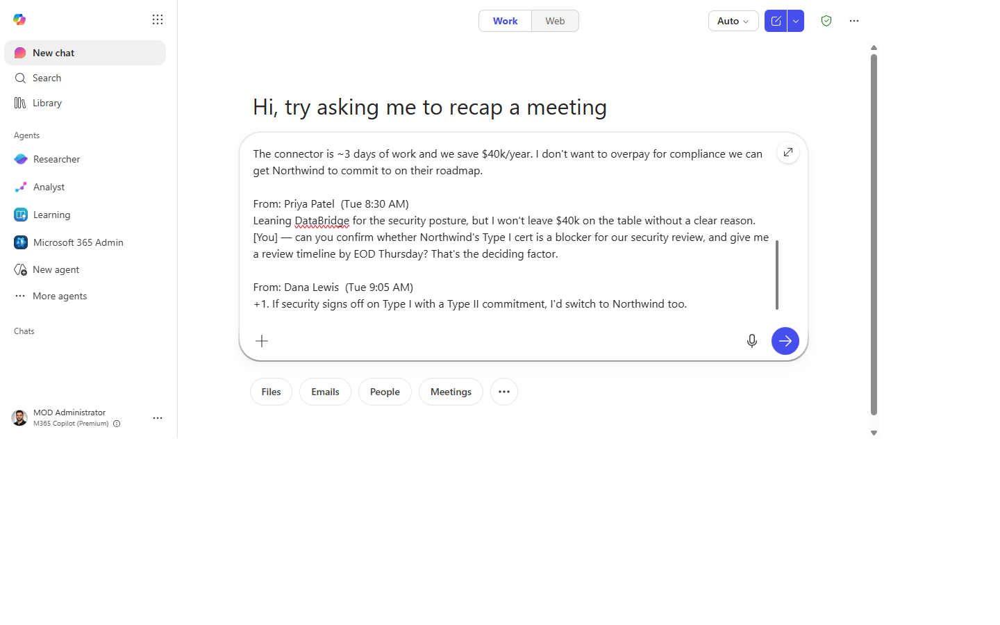
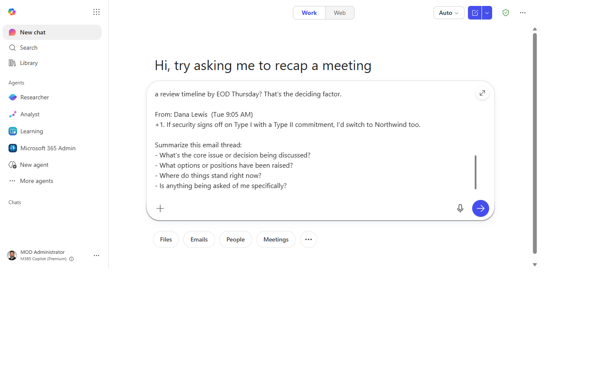
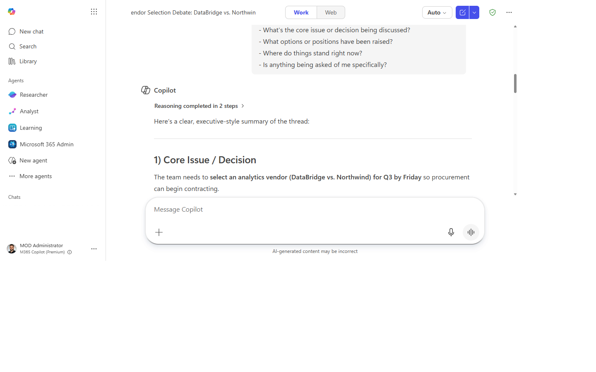
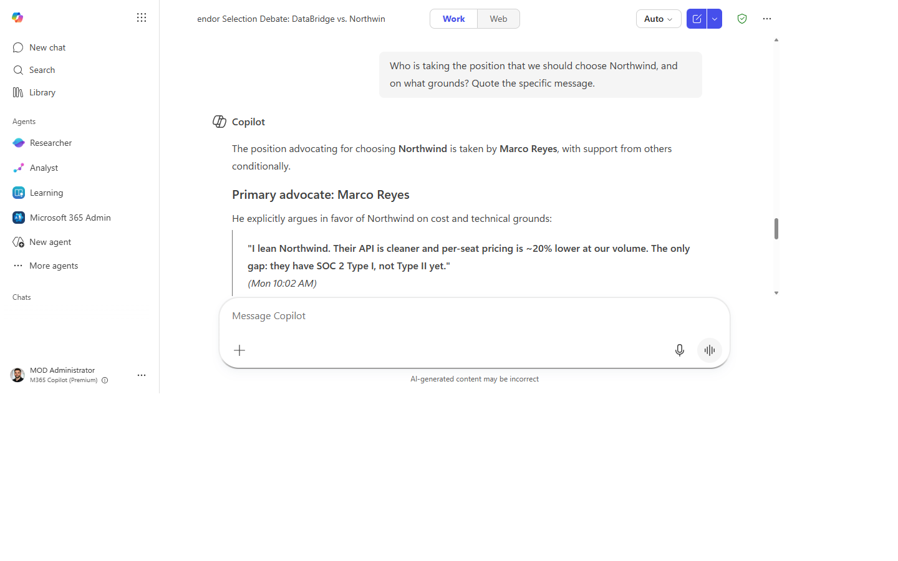
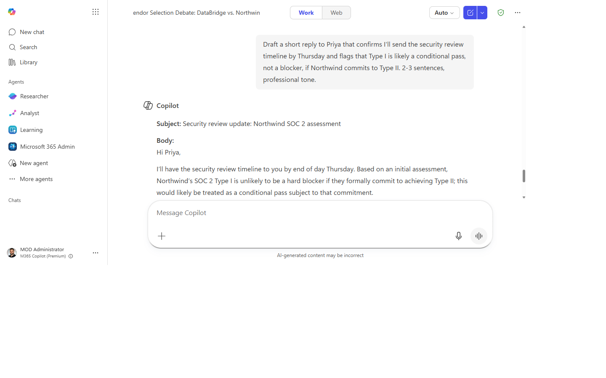

# Catch up on a long email thread in seconds

> Open a 40-message thread and know exactly where things stand — and what's being asked of you — in under a minute.

**Stage:** Copilot Chat · **For:** End user, Manager · **Level:** Starter · **Time:** 5 min · **Saves:** ~15 min vs. manual

## When to use this

You come back from two days out of office and there's a thread with 38 messages about a decision you're supposed to weigh in on. Or someone CC'd you at message 15 and expects you to have context. Or it's 4 PM on Friday and the thread just got a "final decision?" nudge.

Copilot in Outlook and Microsoft 365 Copilot Chat reads the entire thread and distills it to what matters for *you* — the decision state, the open questions, and your specific action item if there is one.

## What you'll need

- **M365 Copilot license** — Copilot in Outlook or Microsoft 365 Copilot Chat
- The email thread open in Outlook, or pasted into Microsoft 365 Copilot Chat

## Try it now — the prompt

In Outlook, open the thread and use the **Copilot** button in the reading pane. Or copy the thread into Microsoft 365 Copilot Chat and paste:

```
Summarize this email thread:
- What's the core issue or decision being discussed?
- What options or positions have been raised?
- Where do things stand right now?
- Is anything being asked of me specifically?
```

**Why this prompt works:** Four specific questions force a structured answer rather than a paraphrase. The last question makes it personal — Copilot will scan for your name or role and flag anything directed at you.

## Step by step

1. **Open the thread in Outlook.** Click the **Copilot** icon in the reading pane — it opens a summary panel automatically.
2. **Type or paste the prompt.** In Microsoft 365 Copilot Chat, paste the thread body directly if you don't have Copilot in Outlook.
3. **Read the summary.** Pay particular attention to "where things stand" — it often reveals the decision was already made without you realizing.
4. **Dig deeper if needed:**
   ```
   Who is taking the position that [X]? Quote the specific message.
   ```
5. **Reply from the summary.** If you need to respond, follow up with:
   ```
   Draft a short reply that [agrees / raises a concern / asks for clarification on X].
   2-3 sentences, professional tone.
   ```

## Screenshots

Captured live in Microsoft 365 Copilot Chat (Work mode). The product UI moves fast — if what you see differs, trust the numbered steps above, which we keep current.

**1. Thread ready in Copilot Chat.** The email thread open (or pasted into the composer).


**2. Prompt entered.** The four-question summary prompt typed into the composer.


**3. The summary.** Core issue, the positions raised, where things stand, and anything asked of you.


**4. Dig deeper.** Quoting the specific message behind a position.


**5. Reply drafted.** A short, professional reply built straight from the summary.


## Tips and variants

- **"What changed since [date]?"** — useful for catching up on a thread you were already on.
- **In Teams:** the same prompt works in the Teams Copilot side panel for a long chat thread.
- **Forward context:** after the summary, ask for a 3-sentence TL;DR to share with someone who needs background.
- **"What's the decision that needs to be made?"** — a single-question follow-up that cuts straight to the point.

## Next:

[:octicons-arrow-right-24: Draft a reply or rewrite an email for a tougher audience](chat-rewrite-email.md)

## Where this leads (the ramp)

Summarizing each hot thread the moment you open it is a great habit — but you're still the one who has to open it. A first-party Project Manager agent watches the workstream for you and surfaces the decisions, risks, and asks without you triaging the inbox.

> **Next:** [Project Manager agent: track a workstream automatically](first-party-project-manager.md)
