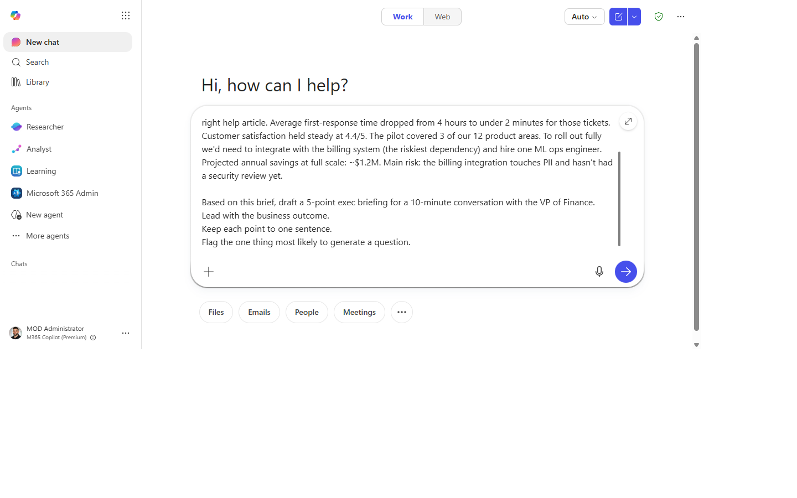
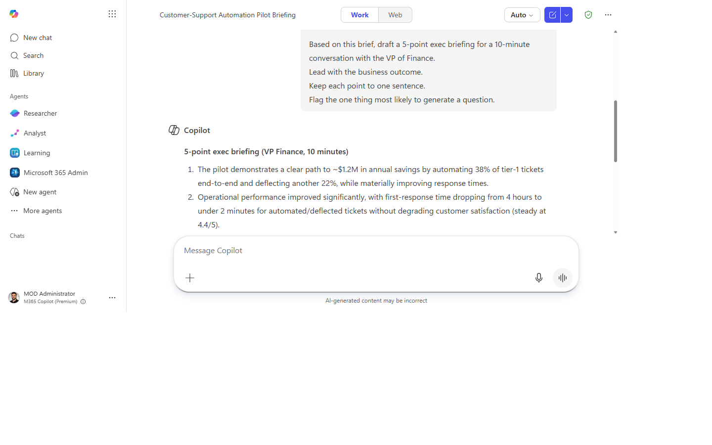
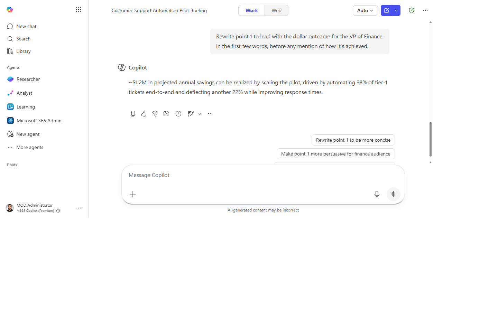
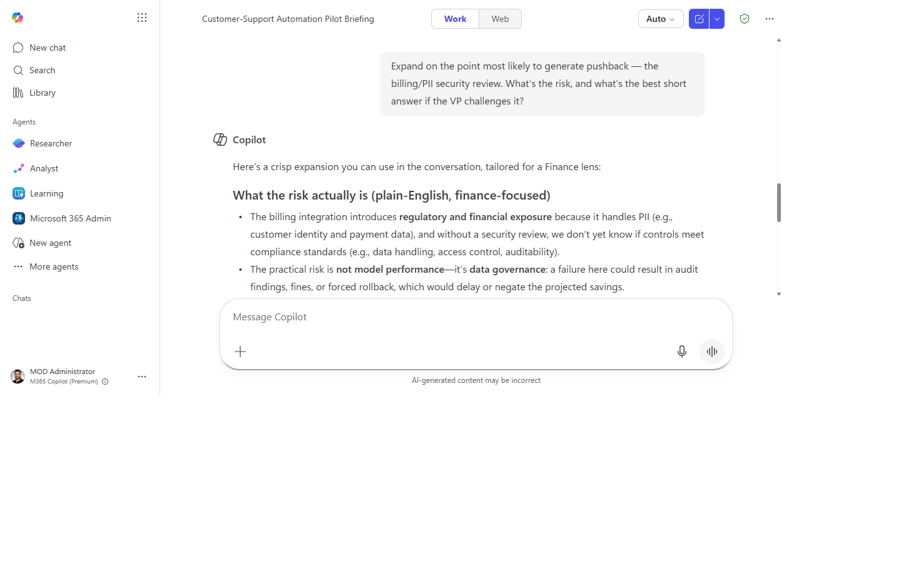

# Draft an exec briefing from background materials

> Walk into any exec meeting with sharp talking points — pulled from your docs, not written from scratch at 8 PM.

**Stage:** Copilot Chat · **For:** End user, Manager · **Level:** Starter · **Time:** 10 min · **Saves:** ~30 min vs. manual

## When to use this

You have a meeting with a VP or C-suite stakeholder in two hours. There's a project brief, a deck, a few email threads — but no time to read them all, synthesize the key points, and draft talking points that lead with business outcomes.

This walkthrough turns a pile of materials into a punchy exec briefing in one prompt. The output is a short list of points you can use as notes, paste into a meeting invite, or share ahead of the call.

## What you'll need

- **M365 Copilot license** — Copilot in Word, Teams, or Microsoft 365 Copilot Chat
- A document, deck, or email thread to ground the briefing on (upload or reference it)
- 2 minutes to review and sharpen the output

## Try it now — the prompt

Open Copilot in Word (with your doc open) or in Microsoft 365 Copilot Chat and paste:

```
Based on [this document / the attached materials], draft a 5-point exec briefing for a
10-minute conversation with [audience / VP of Finance / the leadership team].
Lead with the business outcome.
Keep each point to one sentence.
Flag the one thing most likely to generate a question.
```

**Why this prompt works:** It constrains the length ("5 points"), defines the format ("one sentence each"), names the audience so Copilot can calibrate tone, and asks for the "likely question" — which forces Copilot to surface risk rather than just summarize positively.

## Step by step

> **Microsoft how-to:** [Get instant answers with Microsoft 365 Copilot Chat](https://support.microsoft.com/en-us/topic/get-instant-answers-with-microsoft-365-copilot-chat-fd8d88af-9492-48cd-8385-7e8615b42d80) — the official step-by-step from Microsoft Support.

1. **Open the source material.** In Word (with the doc open) or paste the content into Microsoft 365 Copilot Chat. Multiple sources — a doc and some emails — can all go into the chat.
2. **Paste the prompt** with your audience filled in. If it's a large doc, reference it by name; if it's an email thread, paste the thread directly.
3. **Check the lead.** Is point 1 a business outcome, or is it an activity? If it starts with "We are implementing…" ask:
   ```
   Rewrite point 1 to lead with the outcome for [audience], not the activity.
   ```
4. **Expand the "likely question":**
   ```
   Expand on the point most likely to generate pushback. What's the risk,
   and what's the best short answer if they challenge it?
   ```
5. **Copy to your meeting notes or invite.** A 5-point briefing in the calendar invite body is all the prep most attendees need.

## Screenshots

Captured live in Microsoft 365 Copilot Chat (Work mode). The product UI moves fast — if what you see differs, trust the numbered steps above, which we keep current.

**1. Source material ready.** Copilot Chat open with the background doc or emails pasted in.


**2. Prompt entered.** The exec-briefing prompt typed in with the audience filled in.


**3. The 5-point briefing.** Each point one sentence, leading with outcomes, with the likely question flagged.


**4. Lead rewritten.** Point 1 rewritten to lead with the business outcome, not the activity.


**5. Likely question expanded.** The point most likely to draw pushback, with the risk and a short answer.


## Make it better

- **Tighter output:** add `"Each point max 20 words."` to the prompt.
- **Two-sided view:** add `"Include one 'concern' bullet — something a skeptic might raise."`
- **From a deck:** open the PowerPoint in Copilot — it reads slide titles and speaker notes with the same prompt.
- **Prep someone else:** forward the Copilot output to whoever is actually in the meeting.

## Watch out for

- **Leading with the outcome is persuasive — make sure it's defensible.** Confirm the outcome Copilot asserts is one you can actually stand behind.
- **The “likely question” is a guess at what the room will push on.** You know the audience; add the question Copilot missed.
- **Five tight points can hide an inconvenient detail.** Check that nothing material got compressed away.

## Where this leads (the ramp)

Hand-assembling a briefing from a pile of docs works for one meeting; doing it weekly across many sources gets old fast. The first-party Researcher agent does the deep read across your materials and returns a grounded briefing on demand.

> **Next:** [Researcher agent: deep-dive across your sources](first-party-researcher-deep-dive.md)

## Related

- [Adapt the output for a different audience](chat-adapt-audience.md)

> **📚 Learn more.** Grab paste-ready prompts in the in-product [Copilot Prompt Gallery](https://m365.cloud.microsoft/copilot-prompts), and browse role-based scenarios with downloadable kits in Microsoft's [Scenario Library](https://adoption.microsoft.com/en-us/scenario-library/).