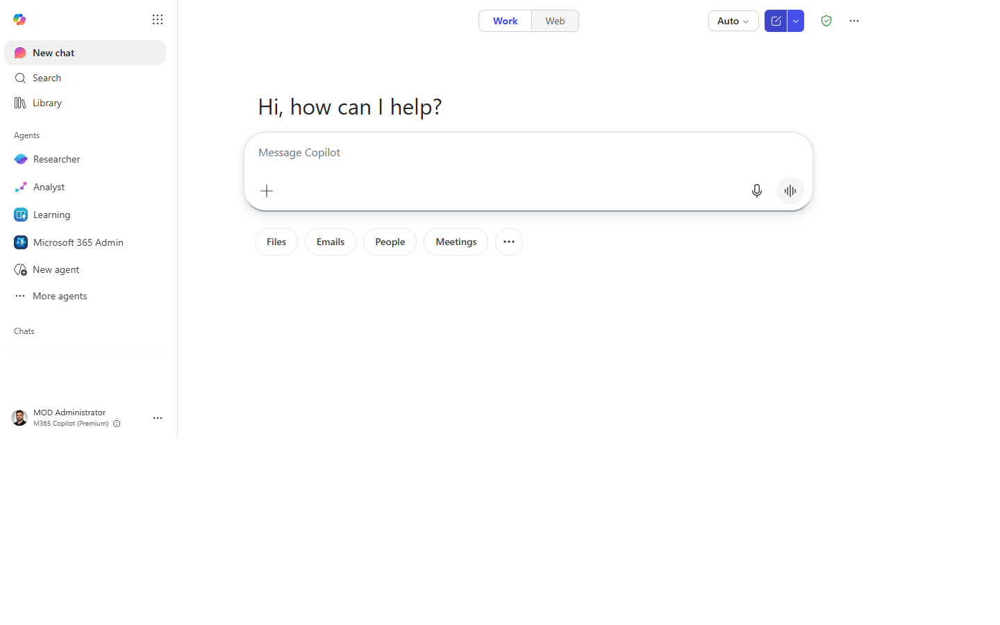
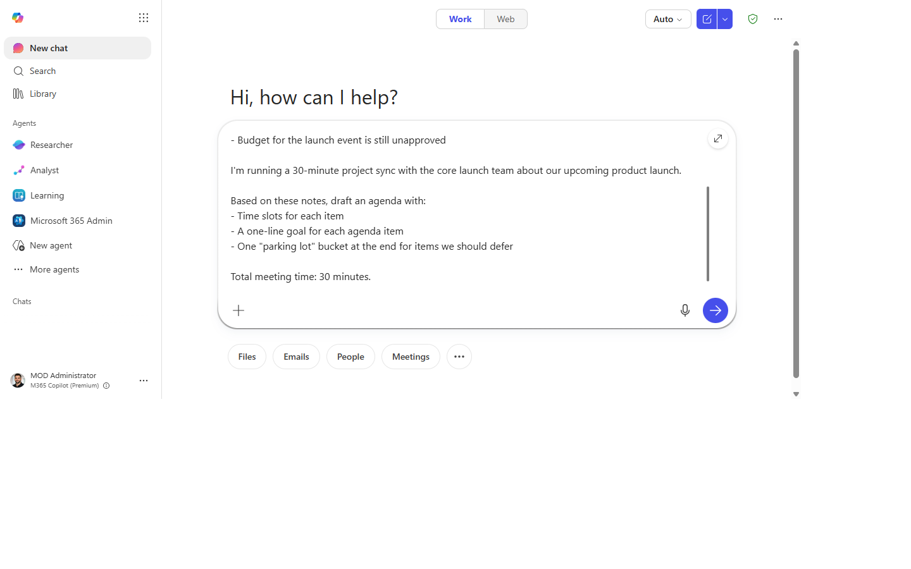
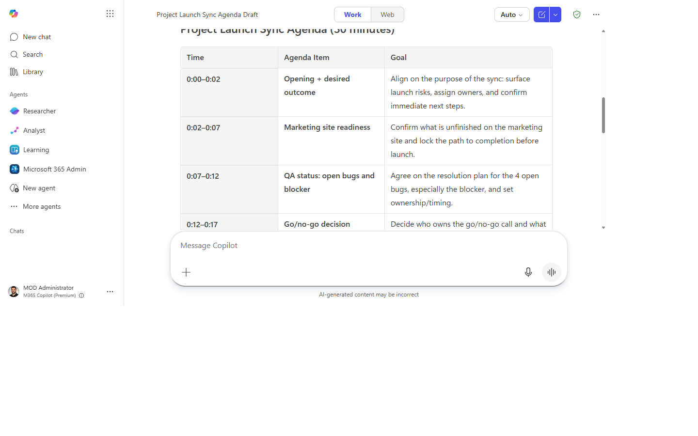
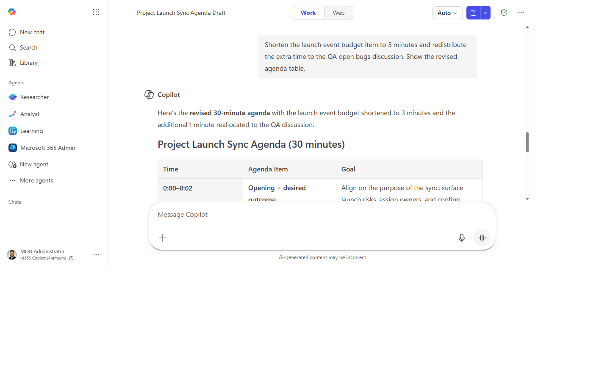
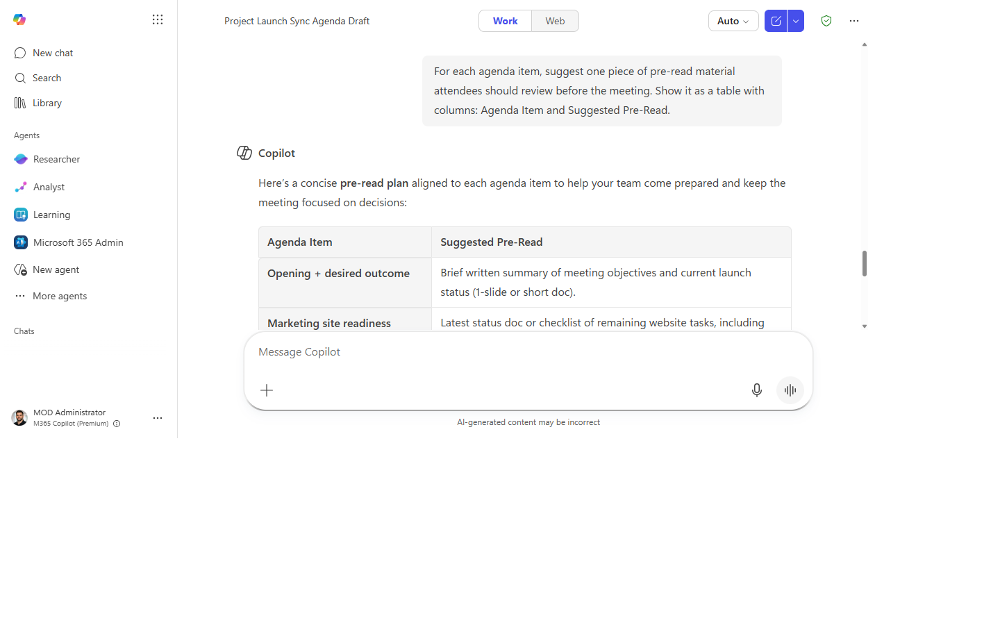

# Build a meeting agenda from context and notes

> Never start an agenda from a blank page — Copilot builds a structured, time-slotted agenda from whatever context you have in under two minutes.

**Stage:** Copilot Chat · **For:** End user, Manager · **Level:** Starter · **Time:** 5 min · **Saves:** ~10 min vs. manual

## When to use this

You're organizing a project sync, a stakeholder update, or a team standup and you need to send an agenda before the meeting. You have *some* context — previous meeting notes, a project brief, a few outstanding issues — but turning that into a clean, time-slotted agenda takes more effort than it should.

This prompt works whether you have a detailed brief or just a topic and a list of names. The output is a structured agenda you can paste directly into a Teams meeting invite.

## What you'll need

- **M365 Copilot license** — Microsoft 365 Copilot Chat or Copilot in Teams
- Some context: previous notes, a doc, outstanding decisions, or just a description of the meeting goal
- The meeting duration and attendee list (rough)

## Try it now — the prompt

Open Microsoft 365 Copilot Chat and paste:

```
I'm running a [30-minute / 60-minute] [project sync / stakeholder update / team standup]
with [audience] about [topic].

Based on [these notes / this background / the last time we met], draft an agenda with:
- Time slots for each item
- A one-line goal for each agenda item
- One "parking lot" bucket at the end for items we should defer

Total meeting time: [30 minutes].
```

**Why this prompt works:** Time slots force prioritization. A goal per item gives attendees pre-reading context. The "parking lot" bucket heads off scope creep during the meeting — it gives tangents a place to land.

## Step by step

1. **Paste your context** into the chat — previous meeting notes, a project brief, or just a few bullet points of what needs to be discussed.
2. **Run the prompt** with your meeting type, audience, and time filled in.
3. **Adjust timing.** If an item feels over- or under-weighted, ask:
   ```
   Shorten [item] to 5 minutes and redistribute the time to [other item].
   ```
4. **Add pre-reads.** Ask:
   ```
   For each agenda item, suggest one piece of pre-read material from my notes that attendees should review.
   ```
5. **Paste into the meeting invite.** Copy the agenda into the Teams invite body — attendees see it in their calendar and can prep.

## Screenshots

Captured live in Microsoft 365 Copilot Chat (Work mode). The product UI moves fast — if what you see differs, trust the numbered steps above, which we keep current.

**1. Context pasted in.** Copilot Chat open with your notes or brief in the composer.


**2. Prompt entered.** The agenda prompt typed in with meeting type, audience, and time.


**3. A time-slotted agenda.** Each item with a time slot and a one-line goal, plus a parking-lot bucket.


**4. Timing adjusted.** One item shortened and the time redistributed across the agenda.


**5. Pre-reads added.** A suggested piece of pre-read material attached to each agenda item.


## Make it better

- **No notes?** Just describe the meeting goal: `"We need to decide whether to extend the deadline for [project]."` Copilot generates the structure.
- **Recurring meeting?** Save the prompt as a recurring Teams chat with yourself and re-run it each week with updated context.
- **After the meeting:** use the same context to ask Copilot to draft the recap email.

## Watch out for

- **Time slots are estimates, not promises.** The discussion that matters always runs long, so build in slack.
- **An agenda built from your notes inherits your blind spots.** Ask whether anything the attendees care about is missing.
- **A parking-lot bucket only works if someone owns it afterward.** Don't let it become a graveyard.

## Where this leads (the ramp)

Building the agenda is the front half of a well-run meeting; the back half is the recap and the follow-ups. The first-party Facilitator agent closes that loop automatically the moment the meeting ends.

> **Next:** [Facilitator agent: auto-recap every meeting](first-party-facilitator-auto-recap.md)

## Related

- [Turn the meeting into tracked follow-ups](chat-meeting-followups.md)
