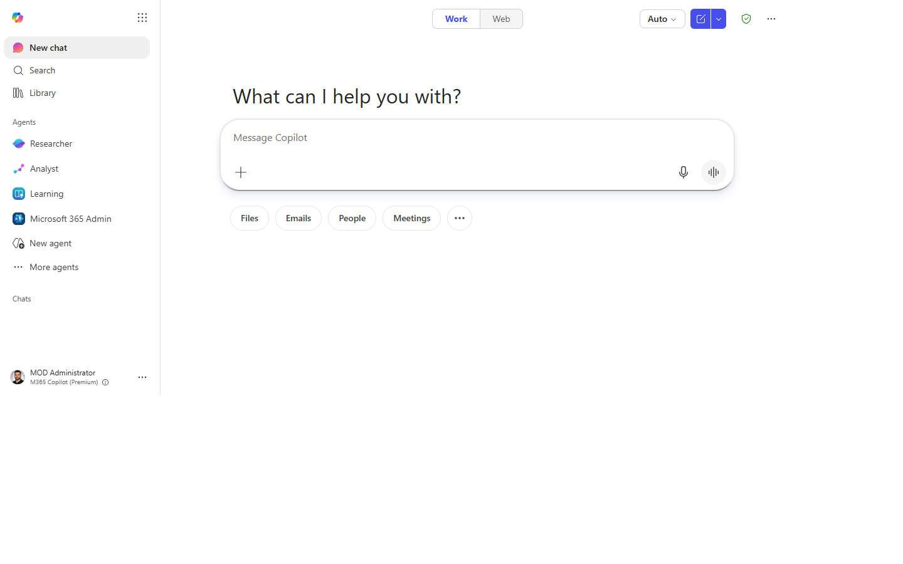
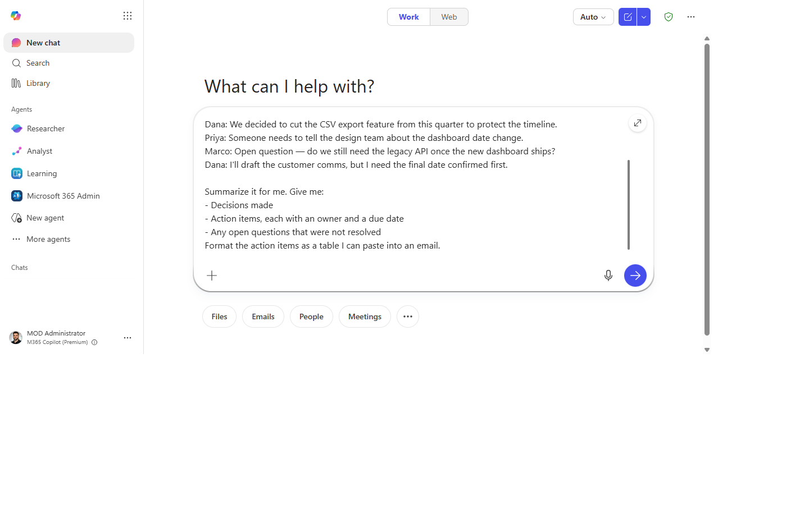
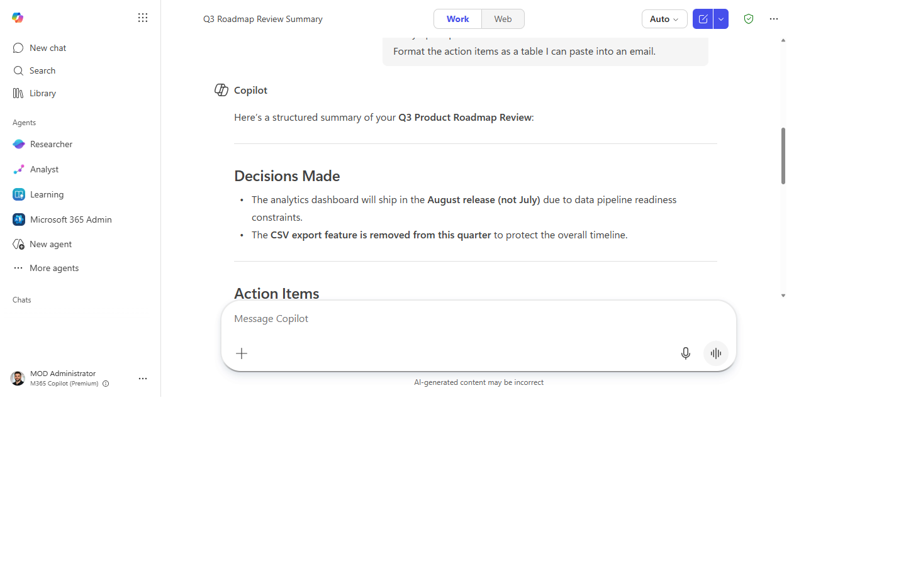
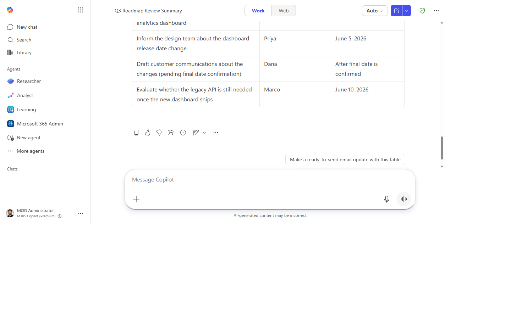

# Turn a meeting into tracked follow-ups

> Walk out of any meeting and have decisions, owners, and due dates captured in
> under five minutes — without re-watching the recording.

**Stage:** Copilot Chat · **For:** End user, Champion · **Level:** Starter · **Time:** 5 min · **Saves:** ~25 min vs. manual

## When to use this
You just finished a 45-minute project sync. Three decisions were made, half a dozen tasks got handed
out, and two things were left hanging — and all of it lives in your memory and a wall of chat. Instead
of scrubbing the recording later tonight, you let Copilot Chat read the meeting and hand you a clean
list while it's still fresh.

This is the single best "first win" for a new Copilot user: it's low-risk, instantly useful, and
shows the magic on day one.

## What you'll need
- **M365 Copilot license** (Copilot in Teams / Microsoft 365 Copilot Chat)
- The meeting had **transcription or recording turned on** (Copilot reads the transcript, not the audio)
- You were an attendee, or have access to the meeting recap

## Try it now — the prompt
Open Copilot in Teams (or Microsoft 365 Copilot Chat) and paste:

```
Summarize the meeting "[meeting name]" from [today/this morning]. Give me:
- Decisions made
- Action items, each with an owner and a due date
- Any open questions that were not resolved
Format the action items as a table I can paste into an email.
```

!!! example "Filled in — a product roadmap sync"
    ```
    Summarize the meeting "Q3 Product Roadmap Review" from this morning. Give me:
    - Decisions made
    - Action items, each with an owner and a due date
    - Any open questions that were not resolved
    Format the action items as a table I can paste into an email.
    ```

**Why this prompt works:** it names the meeting (so Copilot grounds on the right transcript), asks for
*specific* outputs instead of a vague "summary," and dictates the output format ("a table I can paste").
Specific asks + named format = dramatically better results.

## Step by step
1. **Open Copilot in Teams.** From the meeting's recap page, or the Copilot side panel, or
   Microsoft 365 Copilot Chat at office.com. You'll see the chat box.
2. **Paste the prompt** (swap in your meeting name). Copilot reads the transcript and returns a
   structured summary — a short decisions list, an action-item table with owners and dates, and an
   open-questions list.
3. **Sanity-check the owners and dates.** Skim the table. If a due date is missing or an owner looks
   wrong, that's expected — you'll fix it in the next step.
4. **Refine in plain language:**
   ```
   Any action item without a due date — set it to end of this week.
   And the second item should be owned by Priya, not me.
   ```
   Copilot updates the table in place.

## Screenshots

Captured live in Microsoft 365 Copilot Chat (Work mode). The product UI moves fast — if what you see differs, trust the numbered steps above, which we keep current.

**1. Open Copilot Chat.** The composer is ready for your prompt.


**2. Prompt entered.** The meeting-summary prompt pasted in, meeting name filled, ready to send.


**3. Structured response.** Decisions, an action-item table with owners and due dates, and the open questions.


**4. Refined in place.** After one plain-language follow-up — missing due dates filled and an owner corrected.


## Make it better
Once the table is right, chain follow-ups to turn a summary into actual progress:
- `Draft a short email to each owner with just their action items and due dates.`
- `Flag any action item that depends on another one finishing first.`
- `Rewrite the open questions as agenda items for next week's sync.`

Each of these is a separate paste — Copilot keeps the meeting context across the conversation.

## Watch out for
- **No transcript, no summary.** If recording/transcription was off, Copilot has nothing to read.
  Turn it on at the *start* of meetings going forward.
- **Owner attribution can slip.** Copilot infers who owns what from who spoke — verify before you
  send anything. The 30-second check is worth it.
- **Name the meeting precisely.** "This morning's sync" works if you only had one; otherwise use the
  exact title so it grounds on the right transcript.

## Where this leads (the ramp)
Doing this after *every* meeting is the tell that you're ready for **Stage 2**. The first-party
**Facilitator agent** can generate recaps and follow-ups automatically — no prompt required — and
agents in Teams channels can post the action items to the team for you. You've just learned to do by
hand what an agent will soon do on autopilot.

> **Next:** [First-Party Agents → Auto-recap every meeting with Facilitator](first-party-facilitator-auto-recap.md)

## Related
- [Chat → Catch up on a Teams thread you were @mentioned in](../walkthroughs/chat-catch-up-thread.md)
- [Chat → Draft a status update from your week's activity](../walkthroughs/chat-weekly-status.md)
- Stage 1 Resources: see `RESOURCES.md` → Copilot Chat
