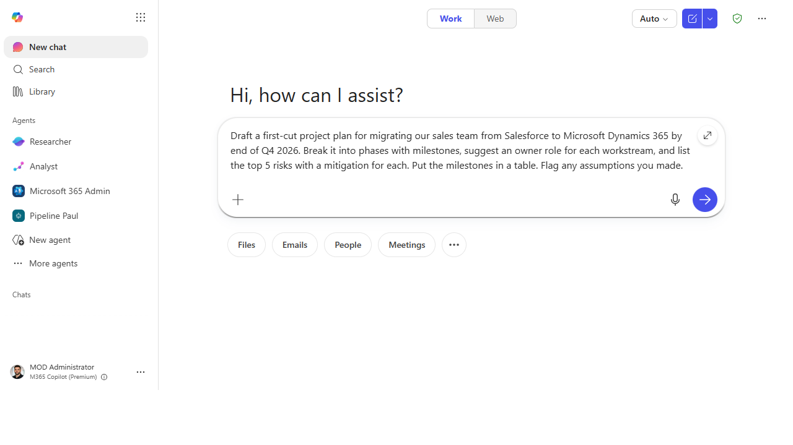
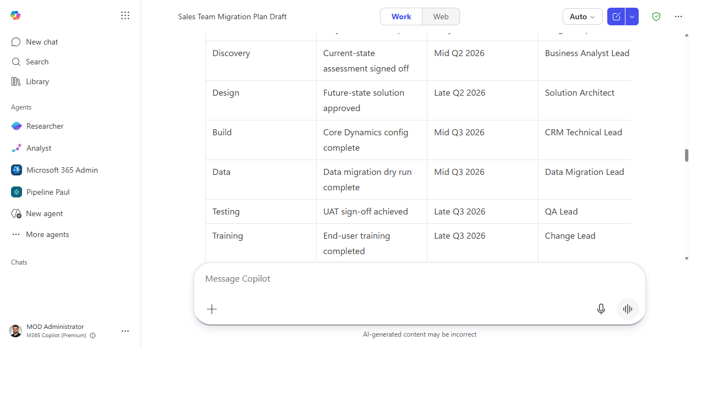

# Build a first-draft project plan

> Go from a blank page and a vague goal to a structured plan — phases, milestones,
> owners, risks — that you can edit in five minutes instead of staring at for an hour.

**Stage:** Copilot Chat · **For:** Champion, Manager · **Level:** Starter · **Time:** 5 min · **Saves:** ~45 min vs. manual

## When to use this
You've been handed an initiative — roll out a tool, run an event, ship a pilot — and you need a plan.
The hard part isn't the work; it's the blank page. Copilot is genuinely good at the *first draft* of
structure: it'll propose phases, sequence milestones, suggest owners by role, and flag the risks you'd
otherwise discover halfway through. You react and refine instead of inventing from nothing.

For champions and managers this is a recurring chore made trivial — and a great prompt to teach your
team, because everyone plans something eventually.

## What you'll need
- **M365 Copilot license** (the Copilot app, or Copilot in Word/Loop to build it in place)
- A goal and any constraints you already know (deadline, team size, budget, must-haves)
- Five minutes to react to the draft — the value is in *your* edits, not the raw output

## Try it now — the prompt
Give Copilot the goal and the shape you want back:

```
Draft a first-cut project plan for [goal] by [deadline]. Break it into phases with
milestones, suggest an owner role for each workstream, and list the top 5 risks with
a mitigation for each. Put the milestones in a table. Flag any assumptions you made.
```

!!! example "Filled in — a CRM migration project"
    ```
    Draft a first-cut project plan for migrating our sales team from Salesforce to
    Microsoft Dynamics 365 by end of Q4 2026. Break it into phases with milestones,
    suggest an owner role for each workstream, and list the top 5 risks with a mitigation
    for each. Put the milestones in a table. Flag any assumptions you made.
    ```

**Why this works:** it specifies the *goal and deadline*, the *structure* (phases → milestones →
owners), a *concrete artifact* (a table), and asks Copilot to **surface its assumptions** — so you can
correct the premise before you build on it.

## Step by step

> **Microsoft how-to:** [Get instant answers with Microsoft 365 Copilot Chat](https://support.microsoft.com/en-us/topic/get-instant-answers-with-microsoft-365-copilot-chat-fd8d88af-9492-48cd-8385-7e8615b42d80) — the official step-by-step from Microsoft Support.

1. **Open Copilot and paste the prompt with your goal.** Copilot returns a structured plan: phases,
   a milestone table, owner roles, and a risk list.
2. **Read the plan and the assumptions.** The assumptions line is gold — it tells you where Copilot
   guessed, which is exactly where you need to inject reality.
3. **Correct the premise, then refine.** Fix any wrong assumption first (a plan built on the wrong
   deadline is wrong everywhere), then tighten phases and owners.
4. **Reshape it for how you'll actually use it:**
   ```
   Compress to three phases, add a "go / no-go" checkpoint after phase one, and
   rewrite the risks as a RAID-style table I can paste into our tracker.
   ```

## Screenshots

Captured live in Microsoft 365 Copilot Chat (Work mode). The product UI moves fast — if what you see differs, trust the numbered steps above, which we keep current.


**Give it the goal and the shape.** Name the deadline, the structure (phases → milestones → owners), and the artifact you want.


**Get a structured first cut.** Phases, a milestone table with owner roles, and a risk list you can edit down.

## Make it better
A plan is a living thing — keep steering:
- **Stress-test the timeline.** "Where is this plan most likely to slip, and what would I do about it?"
- **Right-size it.** "Redo this assuming a team of two, not eight" — Copilot rescopes the whole thing.
- **Turn it into a kickoff.** "Draft the kickoff email and a one-slide summary of this plan" — the plan
  becomes the communication, too.

## Watch out for
- **It's a first draft, not a commitment.** Copilot doesn't know your org's real constraints, politics,
  or capacity. The plan is a scaffold you fill with reality, not a schedule to publish as-is.
- **Owner *roles* aren't owner *names*.** Copilot suggests "a data lead owns X"; assigning the actual
  person — and confirming they have capacity — is your call.
- **Watch the optimism.** AI-drafted timelines tend to assume everything goes right. Pad the estimates
  and keep the risk list honest.

## Where this leads (the ramp)
Building one plan by prompting is step one. The next instinct is *"don't just plan it — pull the inputs
and assemble the whole thing for me."* That's the leap from single prompts to multi-step delegation:
**Stage 3 · Cowork** can read your source notes and produce the plan, the deck, and the summary in one
hand-off.

> **Next:** [Cowork → Build a deck from raw notes](../walkthroughs/cowork-deck-from-notes.md)

## Related
- [Chat → Draft a status update from your week's activity](../walkthroughs/chat-weekly-status.md) — sibling manager daily-driver
- [Chat → Turn a meeting into tracked follow-ups](../walkthroughs/chat-meeting-followups.md) — the Stage 1 flagship

> **📚 Learn more.** Grab paste-ready prompts in the in-product [Copilot Prompt Gallery](https://m365.cloud.microsoft/copilot-prompts), and browse role-based scenarios with downloadable kits in Microsoft's [Scenario Library](https://adoption.microsoft.com/en-us/scenario-library/).
