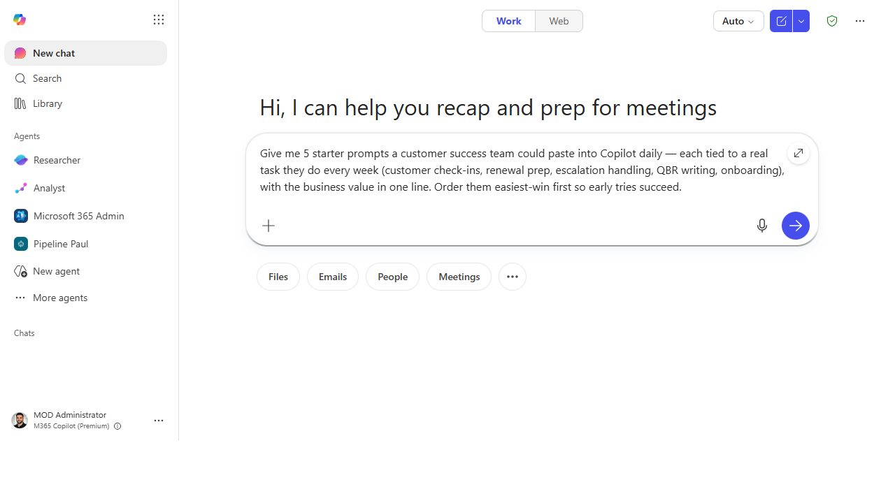
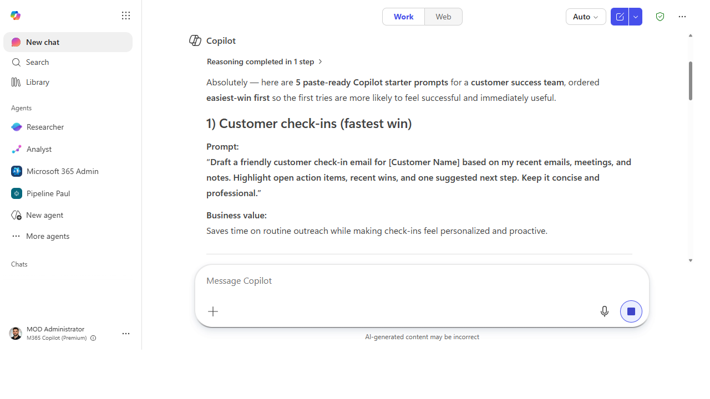

# Run a "Prompt of the Day" for your team

> Adoption isn't a launch, it's a habit. A 30-second daily prompt drip turns "we have
> Copilot" into "we use Copilot" — one small, specific win at a time.

**Stage:** Copilot Chat · **For:** Champion · **Level:** Starter · **Time:** 10 min · **Saves:** ~30 min/week vs. manual

## When to use this
Your team has licenses. A few people are flying; most opened Copilot once and drifted back to the old way.
The gap is never capability — it's *habit*. **Prompt of the Day** is the lightest-weight ritual that
closes it: each day you post one concrete, paste-ready prompt tied to real work, with the value in a single
line. No training session, no calendar invite — just a steady drip that makes trying Copilot the path of
least resistance.

This is the champion's highest-leverage move. One person spends two minutes a day and a whole team builds
the muscle.

## What you'll need
- **M365 Copilot license** across the team and a channel they already read (Teams channel, email, standup)
- A **role lens** — prompts for a finance team differ from a sales team; tailor to the actual work
- Two minutes a day, and the discipline to keep it boringly consistent (consistency *is* the feature)

## Try it now — the prompt
Have Copilot generate your first week's drip, tuned to your team:

```
Give me 5 starter prompts a [marketing] team could paste into Copilot daily —
each tied to a real task they do every week, with the business value in one line.
Order them easiest-win first so early tries succeed.
```

!!! example "Filled in — a customer success team"
    ```
    Give me 5 starter prompts a customer success team could paste into Copilot daily —
    each tied to a real task they do every week (customer check-ins, renewal prep,
    escalation handling, QBR writing, onboarding), with the business value in one line.
    Order them easiest-win first so early tries succeed.
    ```

**Why this works:** it asks for **role-specific, real-task** prompts (not generic demos), forces a
**one-line value** so people see the point instantly, and **sequences easiest-first** so the first try
lands. A team that wins on day one comes back on day two — that's the whole mechanism.

## Step by step
1. **Pick the channel and the cadence.** Post where the team already looks, once a day, same time. A drip
   they have to go find is a drip they'll miss.
2. **Lead with the win, not the prompt.** One line of "here's what this saves you," then the paste-ready
   prompt. People try things that obviously pay off.
3. **Celebrate the first reply.** When someone posts "that just saved me an hour," amplify it. Social proof
   from a peer beats any mandate from above.
4. **Refill the queue from real wins:**
   ```
   Based on the wins my team shared this week, draft next week's 5 prompts —
   build on what landed and stretch slightly harder each day.
   ```

## Screenshots

Captured live in Microsoft 365 Copilot Chat (Work mode). The product UI moves fast — if what you see differs, trust the numbered steps above, which we keep current.


**Ask for role-specific, real-task prompts.** One line of value each, easiest-win first.


**Get a week's worth of drip prompts.** Each tied to a real task, with the business value spelled out.

## Make it better
The drip compounds when you turn it into a system:
- **Pull from the Prompt Gallery.** Don't write every prompt from scratch — Microsoft's gallery is a
  bottomless source of role-tested starters you can adapt in seconds.
- **Theme the week.** "Email week," "meeting week," "research week" — clustering related prompts builds a
  capability instead of scattering one-offs.
- **Let the value data steer it.** Pair this with Workforce insights: where your team is underusing
  Copilot is exactly where next week's prompts should aim.

> **📚 Learn more.** The [Copilot Prompt Gallery (adoption guide)](https://adoption.microsoft.com/en-us/copilot/prompt-gallery/)
> and the in-product [Prompt Gallery](https://m365.cloud.microsoft/copilot-prompts) are your bottomless
> source of role-tested prompts, and the [Copilot Success Kit](https://adoption.microsoft.com/en-us/copilot/success-kit/)
> has champion-ready enablement templates for running rituals like this.

## Watch out for
- **Consistency beats cleverness.** A mediocre prompt posted every day builds more habit than a brilliant
  one posted sporadically. Protect the cadence above all.
- **Generic prompts get ignored.** "Summarize a document" is a yawn; "summarize the weekly pipeline report
  for your 1:1" gets tried. Specific to *their* work, every time.
- **Don't mandate — entice.** The moment it feels like a compliance task it dies. Keep it opt-in, useful,
  and celebratory, and people pull it toward themselves.

## Where this leads (the ramp)
Once the daily Copilot habit is real, your team stops asking "what can it do?" and starts asking "what
*else* can it do?" That curiosity is the on-ramp to **Stage 2 · First-Party Agents** — the prebuilt agents
already in their license that do more than a single prompt ever could.

> **Next:** [First-Party → The first-party agents included with your M365 Copilot license](../walkthroughs/first-party-agents-overview.md)

## Related
- [Copilot Chat → Turn a meeting into tracked follow-ups](../walkthroughs/chat-meeting-followups.md) — the flagship first win to drip
- [First-Party → Find where Copilot is landing with Workforce insights](../walkthroughs/first-party-workforce-insights.md) — data to steer the drip
- Stage 1 Resources: see `RESOURCES.md` → Copilot Chat
