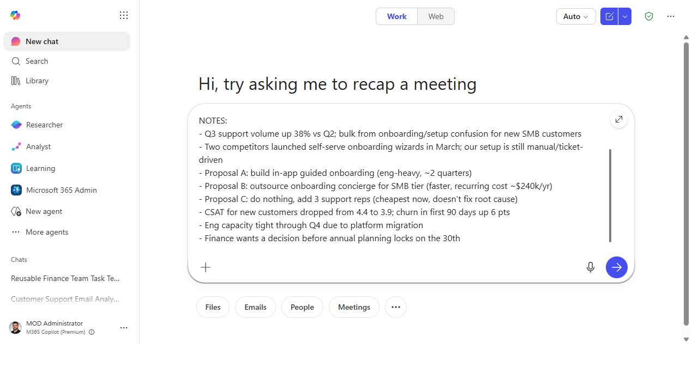
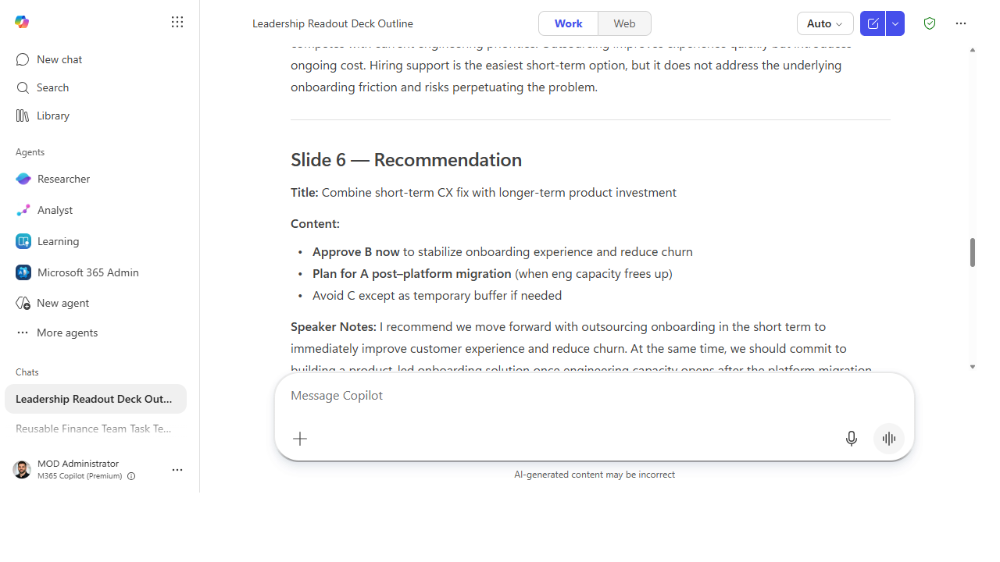
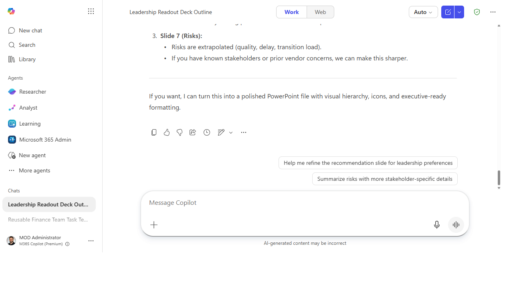

# Build a deck from raw notes

> Hand Cowork your messy notes and let it come back with a real slide deck —
> structure, narrative, and draft slides — so you start from a v1 instead of a blank canvas.

**Stage:** Cowork · **For:** End user, Champion · **Level:** Intermediate · **Time:** 15 min

## When to use this
You have the raw material — meeting notes, a transcript, a doc, a wall of bullet points — and you need a
deck by tomorrow. In Stage 1 you'd prompt Copilot slide by slide. **Cowork** is the leap: you hand off
the *whole job* — "read these, figure out the story, build the slides" — and it does the multi-step work,
not just one turn of it. This is the moment delegation stops being a single prompt and becomes an
assignment.

For end users it's the first taste of "do the whole thing for me"; for champions it's the demo that makes
a room lean in — everyone has notes that should've been a deck.

## What you'll need
- **M365 Copilot license** with **Cowork** access
- The raw source — notes, a transcript, a doc, or a few of them together
- A sense of the audience and the takeaway, so Cowork builds toward a point, not just a pile of slides

## Try it now — the prompt
Give Cowork the source and the shape of the deck you want back:

```
From these notes, build a 7-slide deck for a leadership readout. Open with the
decision we need, then context, options, recommendation, risks, and next steps.
Keep one idea per slide, draft speaker notes, and tell me which slides you were
least sure about so I can check them.
```

**Why this works:** it sets the *length* (7 slides), the *audience* (leadership), the *narrative arc*
(decision-first), a *quality constraint* (one idea per slide + speaker notes), and asks Cowork to **flag
its low-confidence slides** — so you know exactly where to apply judgment.

## Step by step
1. **Point Cowork at your notes and send the prompt.** Cowork reads the source, proposes a structure, and
   assembles the draft slides — a multi-step job from one hand-off.
2. **Review the storyline before the slides.** The arc matters more than any single slide. Confirm the
   narrative lands before you polish wording.
3. **Check the flagged slides first.** The slides Cowork was unsure about are where your domain knowledge
   earns its keep — fix those before the cosmetic pass.
4. **Steer the revision in plain language:**
   ```
   Merge slides 3 and 4, make the recommendation slide the visual climax, and
   redo the risks as a two-column "risk / mitigation" table.
   ```

## Screenshots

Captured live in Microsoft 365 Copilot (Work mode). The product UI moves fast — if what you see differs, trust the numbered steps above, which we keep current.


**Hand Cowork your raw notes plus the shape of the deck you want — length, audience, narrative arc, and a request to flag its low-confidence slides.**


**Cowork returns a real slide-by-slide outline with titles, content, and drafted speaker notes — a v1 deck instead of a blank canvas.**


**It flags the slides it was least sure about so you know where to apply judgment, then offers to turn the outline into a polished PowerPoint file.**

## Make it better
One hand-off, many outputs:
- **Ask for the companion pieces.** "Now draft the email that sends this deck and a one-paragraph
  summary for people who won't open it." The deck becomes the whole communication.
- **Reshape for a different room.** "Redo this for a technical audience — more detail on the how, less on
  the why." Same source, different altitude.
- **Pull from more than notes.** Point it at the source doc *and* the meeting transcript together and let
  it reconcile them into one story.

> **📚 Learn more.** The [M365 Copilot resources hub](https://aka.ms/m365copilot/resources) covers how
> Cowork fits the broader Copilot experience. For a parallel community take on delegating real work to
> Cowork, [Sean Galliher's Cowork Cookbook](https://coworkcookbook.com/) (community-built, unofficial —
> not a Microsoft resource) is worth a look.

## Watch out for
- **The story is yours; the draft is Cowork's.** It can structure and draft, but the *argument* — what
  you're actually asking the room to decide — has to be yours. Read for the point, not just the polish.
- **Check every fact that made it onto a slide.** Numbers, names, and dates pulled from notes can be
  miscopied or misread. A wrong figure on a leadership slide is expensive.
- **Don't ship the first pass.** Cowork gets you to a strong v1 fast — that's the win. The value is in the
  two minutes of steering after, not in publishing the raw output.

## Where this leads (the ramp)
You just delegated a whole multi-step *task* — read, reason, assemble — and got an artifact back. The next
instinct is *"I do this same job every week; I wish I had an agent that already knew how."* That's the
move from delegating a task to **building** the thing that does it: **Stage 4 · Agent Builder**.

> **Next:** [Agent Builder → Build a team-knowledge agent over a SharePoint site](../walkthroughs/agent-builder-team-knowledge.md)

## Related
- [Cowork → Hand off an end-to-end task to Cowork](../walkthroughs/cowork-end-to-end-task.md) — the Stage 3 flagship
- [Chat → Build a first-draft project plan](../walkthroughs/chat-project-plan.md) — the Stage 1 version that feeds this
- Stage 3 Resources: see `RESOURCES.md` → Cowork
