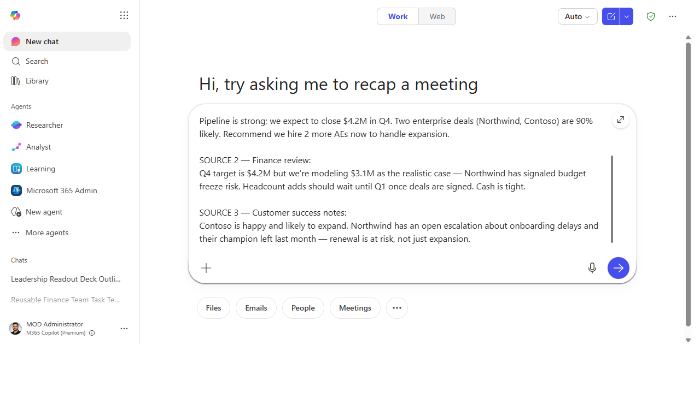
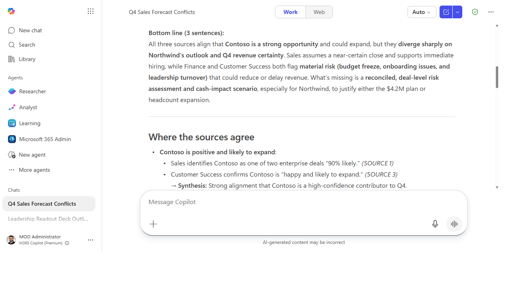
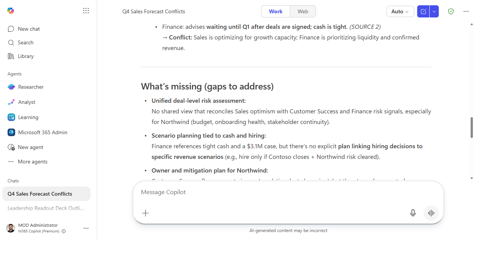

# Synthesize many documents into one brief

> Point Cowork at a stack of documents and get back one coherent brief — the throughline,
> the conflicts, the gaps — instead of reading all of them yourself and hoping you held it in your head.

**Stage:** Cowork · **For:** Maker, Manager · **Level:** Intermediate · **Time:** 15 min

## When to use this
Five docs say overlapping things. A SharePoint folder, a few email threads, a couple of reports — and you
need *one* answer that reconciles them. Reading them all is hours; holding the contradictions in your head
is impossible. **Cowork** does the synthesis job end to end: it reads across the set, finds the common
thread, surfaces where the sources disagree, and hands you a single brief you can actually act on.

For managers this is the "give me the truth across all of this" button; for makers it's a preview of the
reasoning an agent will do for you on a schedule once you build one.

## What you'll need
- **M365 Copilot license** with **Cowork** access
- The document set — files, threads, or a folder; the more they overlap, the more synthesis earns its keep
- The question you actually need answered, so Cowork synthesizes *toward* a decision

## Try it now — the prompt
Point Cowork at the set and tell it what the brief is for:

```
Read all of these and write me one brief: what they agree on, where they conflict,
and what's missing. Lead with a 3-sentence bottom line, then the supporting detail,
and cite which source each claim came from. Flag anything where the sources
disagree so I know what to dig into.
```

**Why this works:** it names the *job* (synthesize, don't summarize each), the *structure* (bottom-line-
first), a *traceability requirement* (cite the source per claim), and asks Cowork to **surface conflicts**
— which is the part you can't get from reading any single doc.

## Step by step
1. **Give Cowork the full set and send the prompt.** It reads across every source and works the synthesis
   as one multi-step job, not a doc-by-doc summary.
2. **Read the bottom line first, then the conflicts.** The three-sentence top is the answer; the conflict
   flags are where you decide what still needs a human.
3. **Trace the claims that matter.** For any load-bearing statement, follow the citation back to the
   source before you rely on it. Synthesis is only as good as its grounding.
4. **Tighten it for how you'll use it:**
   ```
   Cut it to one page, drop anything all the sources already agree on, and turn the
   conflicts into a short "open questions" list I can take into the review.
   ```

## Screenshots

Captured live in Microsoft 365 Copilot (Work mode). The product UI moves fast — if what you see differs, trust the numbered steps above, which we keep current.


**Paste the full set of sources and tell Cowork what the brief is for — bottom-line-first, cited per claim, with conflicts flagged.**


**The brief leads with a three-sentence bottom line, then lays out where the sources agree — each point cited back to its source.**


**Then it surfaces exactly where the sources conflict and what's missing — the part you can't get from reading any single document.**

## Make it better
Synthesis is a starting point, not an endpoint:
- **Aim it at a decision.** "Based on all of this, what would you recommend and why?" — then pressure-test
  the recommendation against the conflicts it found.
- **Make it repeatable.** "Every Monday, re-run this over the latest versions and tell me only what
  changed." You've just described an agent's job.
- **Widen the aperture.** Add a competitor report or an external source and ask it to reconcile internal
  and outside views into one picture.

> **📚 Learn more.** The [M365 Copilot resources hub](https://aka.ms/m365copilot/resources) covers how
> Cowork handles multi-source work across the Copilot experience. For a parallel community treatment of
> delegating end-to-end jobs to Cowork, [Sean Galliher's Cowork Cookbook](https://coworkcookbook.com/)
> (community-built, unofficial — not a Microsoft resource) is worth a read.

## Watch out for
- **Synthesis isn't truth — it's a reading.** Cowork reconciles what the sources *say*; if they're all
  wrong in the same way, the brief inherits that. Treat the bottom line as a strong hypothesis.
- **Citations are the safety rail — use them.** A synthesized claim with no traceable source is the one to
  distrust. If you can't follow it back, don't build on it.
- **Watch for quiet flattening.** When sources conflict, a synthesis can average them into a blandly
  "balanced" line that hides a real disagreement. The conflict flags exist so that doesn't happen — read
  them.

## Where this leads (the ramp)
You've now had Cowork do the reasoning across a whole document set — and you probably noticed you'd want
this *same* job run on a schedule, over a *known* set of sources, without re-explaining it each time. That
standing, source-scoped reasoner is exactly what you **build** next: **Stage 4 · Agent Builder**.

> **Next:** [Agent Builder → Build a team-knowledge agent over a SharePoint site](../walkthroughs/agent-builder-team-knowledge.md)

## Related
- [Cowork → Hand off an end-to-end task to Cowork](../walkthroughs/cowork-end-to-end-task.md) — the Stage 3 flagship
- [First-Party → Deep-dive a topic with Researcher](../walkthroughs/first-party-researcher-deep-dive.md) — the single-agent version of this reasoning
- Stage 3 Resources: see `RESOURCES.md` → Cowork
