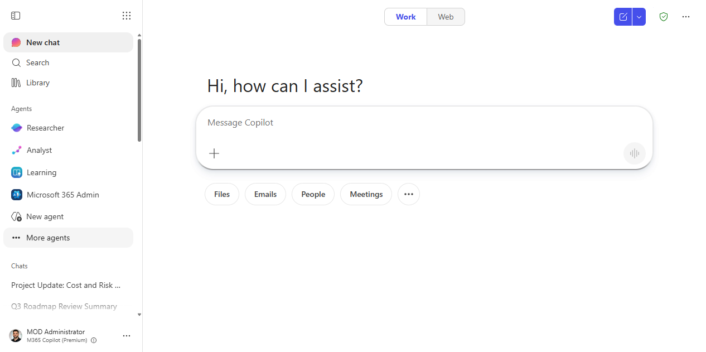
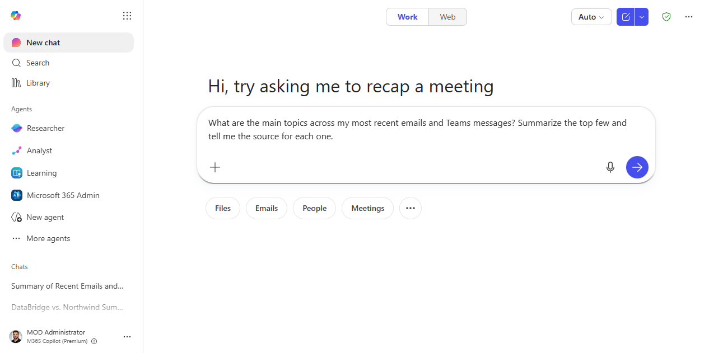
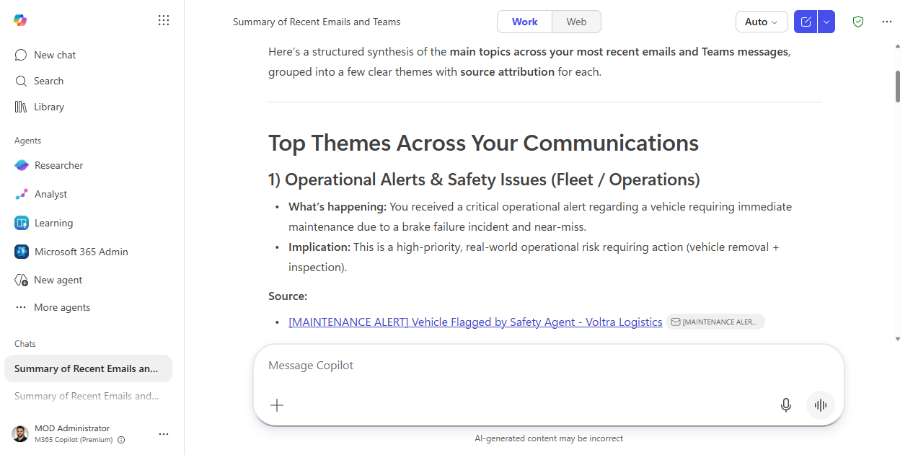
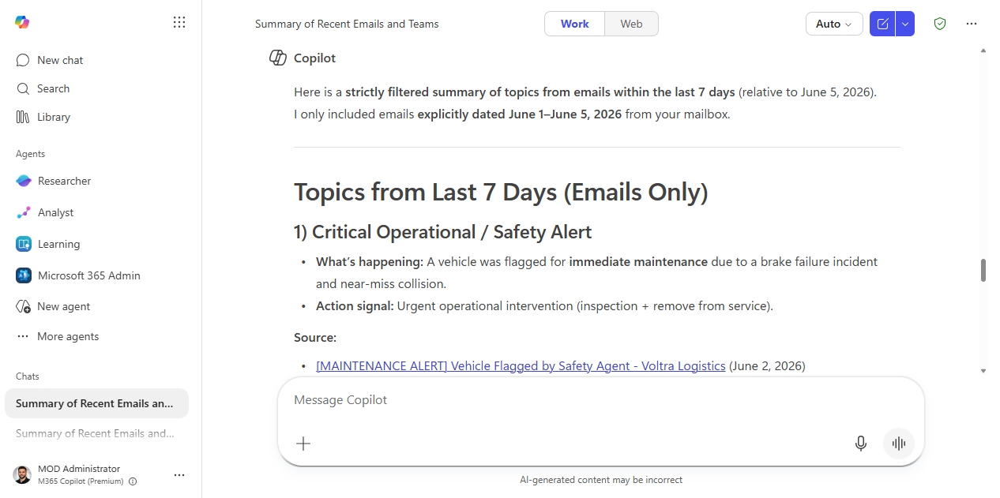
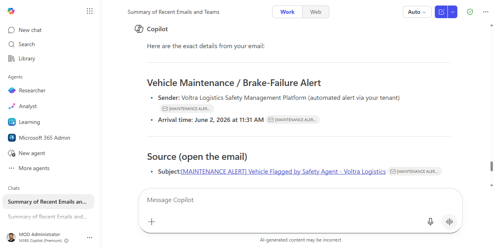

# Find answers across your organization's content with BizChat

> Search your entire company's SharePoint, emails, and Teams conversations in one question — and get a cited answer, not a list of links.

**Stage:** First-Party Agents · **For:** End user, Manager · **Level:** Starter · **Time:** 5 min

## When to use this

You need an answer that lives somewhere in your organization — a policy buried in a SharePoint doc, a decision made in a Teams meeting three months ago, a number from a spreadsheet someone else owns. You don't know exactly where it is, and searching SharePoint returns 400 results.

Microsoft 365 Copilot Chat (BizChat) is grounded on your organization's entire content graph: emails you've exchanged, Teams conversations you've been part of, SharePoint sites you have access to, and files shared with you. Ask it a question and it synthesizes the answer with citations — so you can verify the source.

## What you'll need

- **M365 Copilot license** — Microsoft 365 Copilot Chat at office.com or the M365 Copilot app
- Access to the content where the answer lives (BizChat can only see what *you* have permission to access)

## Try it now — the prompt

Open Microsoft 365 Copilot Chat and paste:

```
Find information about [topic] from across our company's SharePoint, emails, and Teams.
Summarize what you find and tell me where each piece of information came from.
```

**Why this prompt works:** Asking Copilot to cite sources is key — it keeps you from accepting hallucinated answers and lets you open the original document in one click to verify.

## Step by step

1. **Open Microsoft 365 Copilot Chat** at office.com, in Teams, or in the M365 Copilot app.
2. **Ask your question in plain language.** Don't try to construct a search query — just ask what you'd ask a knowledgeable colleague.
   - `"What's our process for approving travel over $5,000?"`
   - `"What did we decide about [product feature] in the Q3 planning meeting?"`
   - `"What's the current status of [project] from recent emails?"`
3. **Check the citations.** Each piece of the answer should link to a source. Click through to verify the key facts — especially for anything involving policy, numbers, or commitments.
4. **Narrow the scope if needed:**
   ```
   Only look in SharePoint sites related to [team / project name].
   ```
   ```
   Only look at emails from the last 30 days.
   ```
5. **Ask a follow-up** to go deeper:
   ```
   Who is the owner of that policy document and when was it last updated?
   ```

## Screenshots

Captured live in Microsoft 365 Copilot Chat (BizChat, Work mode). The product UI moves fast — if what you see differs, trust the numbered steps above, which we keep current.

**1. Open BizChat.** Microsoft 365 Copilot Chat in Work mode, grounded on your org's content.


**2. Prompt entered.** The cross-content question typed into the composer.


**3. A cited answer.** A synthesized answer that groups themes across email and Teams, with a labelled **Source** link for each you can click to verify.


**4. Narrow the scope.** The same question re-scoped to a date range — here, just the last 7 days of email — each topic still cited.


**5. Go deeper.** A follow-up pinning down who sent a specific item and when, with the source email linked to open.


## Tips and variants

- **People-based search:** `"What has [colleague's name] shared recently about [topic]?"` — useful for catching up on a teammate's work.
- **Decision archaeology:** `"Was there ever a decision made about [X]? Summarize the context."` — surfaces decisions from old threads you weren't part of.
- **Content gap check:** `"Is there any documentation in SharePoint about [process]? If not, summarize what you can find from emails and Teams."` — useful for champions building knowledge bases.
- **Compare to the public web:** unlike a standard web search, BizChat grounds on *your* org's data. For topics that span internal and external knowledge, you may want to supplement with a standard Researcher deep-dive.

## Next:

[:octicons-arrow-right-24: Share the answer as a collaborative Copilot Page](first-party-copilot-pages.md)

## Where this leads (the ramp)

A cited BizChat answer is perfect when one good question gets you what you need. When the question is really a research project — read these twelve documents, reconcile them, and produce a deliverable — Cowork runs that as a multi-step task instead of a single turn.

> **Next:** [Cowork: synthesize a deliverable across many documents](cowork-multi-doc-synthesis.md)
