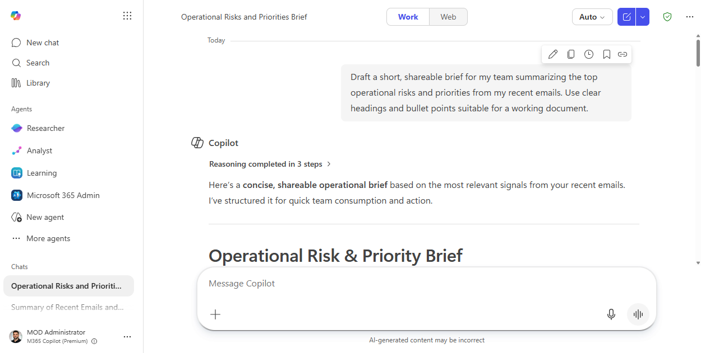
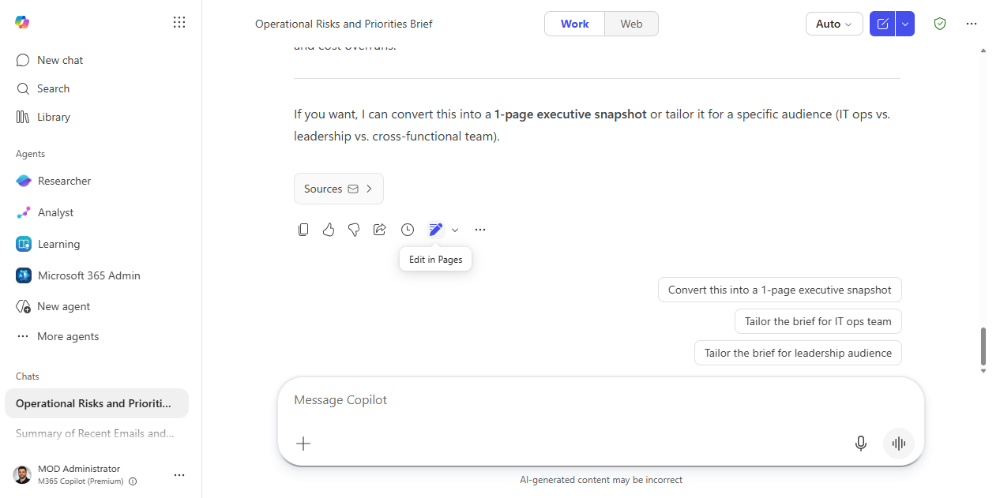
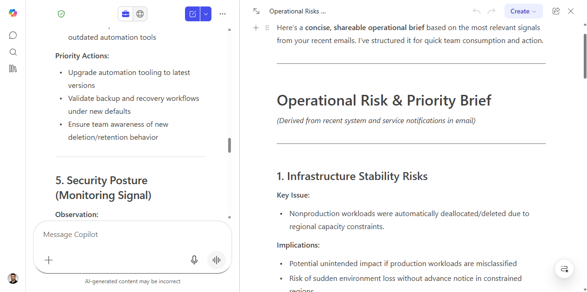
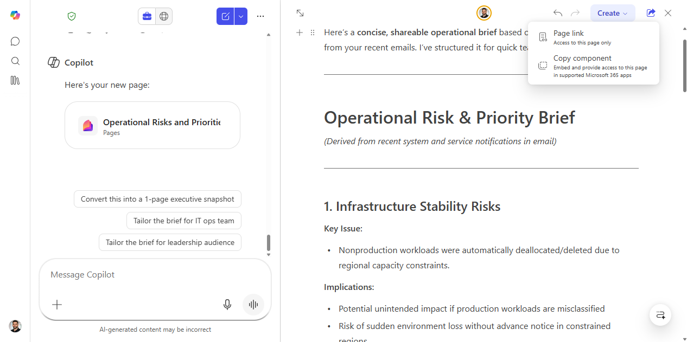

# Share and co-edit an AI output with Copilot Pages

> Turn any Copilot response into a shared, editable collaborative page — no copy-pasting, no formatting, no emailing a draft doc back and forth.

**Stage:** First-Party Agents · **For:** End user, Manager, Champion · **Level:** Starter · **Time:** 10 min

## When to use this

You've asked Copilot to research something, draft a brief, build a plan, or synthesize a set of documents — and now you want to hand that output to colleagues as a collaborative document, not a chat transcript they can't edit.

Copilot Pages solves the handoff problem. One click turns a Copilot response into a live, editable Loop-based page that everyone on your team can open, refine, and build on together — in real time.

## What you'll need

- **M365 Copilot license** — Microsoft 365 Copilot Chat (at office.com or the M365 Copilot app)
- A Copilot response worth sharing (a summary, a plan, a research output)
- Colleagues who have access to Microsoft 365

## Try it now — the prompt

Run this in Microsoft 365 Copilot Chat to produce an output worth turning into a shared page — then use **Edit in Pages** on the response:

```
Draft a one-page project status brief for [project name] based on our recent
emails, chats, and documents. Include: where things stand, what's blocked,
decisions still needed, and the next three milestones with owners. Write it so
the team can edit and add to it as a working document.
```

**Why this prompt works:** it asks for a structured, editable working document rather than a quick answer, so the response is already shaped for a Page the team can refine together.

## How it works

After any Copilot response in Microsoft 365 Copilot Chat, you'll see an **Edit in Pages** button (or an option to open the response as a Page). This creates a Loop-based page pre-populated with the AI content — immediately shareable, collaborative, and editable.

## Step by step

1. **Get a Copilot output worth keeping.** Run any research, summary, or planning prompt in Microsoft 365 Copilot Chat. For example:
   ```
   Summarize the state of [project] based on our recent emails and documents.
   Give me a brief suitable for sharing with the team as a working document.
   ```
2. **Click "Edit in Pages"** in the Copilot response toolbar. This opens the content in a new Copilot Page.
3. **Review and clean up.** The page is now fully editable — add context, restructure sections, remove anything that shouldn't go to the group.
4. **Share the page.** Use the **Share** button in the top-right of the page to copy a link or send it directly in Teams. Recipients can open and edit without needing to request access.
5. **Collaborate in real time.** Team members can add comments, edit sections, and @mention each other — the page updates live like a Loop component.

## Screenshots

Captured live in Microsoft 365 Copilot Chat and Copilot Pages. The product UI moves fast — if what you see differs, trust the numbered steps above, which we keep current.

**1. A Copilot output worth keeping.** A shareable operational brief generated in Microsoft 365 Copilot Chat.


**2. Edit in Pages.** The "Edit in Pages" control in the response toolbar.


**3. The editable page.** The response opens beside the chat as a Loop-based Copilot Page — a fully editable canvas.


**4. Share the page.** The Share menu — copy a page link, or embed the page as a live component in your Microsoft 365 apps. Recipients open and co-edit without requesting access.


## Make it better

- **Embed in a Teams channel:** paste the Copilot Page link into a channel tab — it renders as an editable page right inside Teams.
- **Use it for meeting prep:** generate talking points or an agenda in Copilot, push to a Page, share with attendees, and let them add context before the meeting.
- **Iterative research:** have each team member add their own inputs to the page, then ask Copilot to re-summarize with the new context added.
- **Pages as a knowledge capture habit:** at the end of a major project, prompt Copilot for a lessons-learned summary and save it as a Page in the team's SharePoint.

## Watch out for

- **Access mismatch.** A Page has its own sharing settings — confirm recipients can open it, and don't push content into a Page that's broader than the audience should see.
- **Edits don't flow back to chat.** Once you push to a Page, the chat response and the Page are separate — keep editing in the Page, not the original response.
- **Half-baked outputs.** Pages amplifies whatever you start with; clean up the response before sharing so the team builds on a solid draft, not a rough one.

## Where this leads (the ramp)

Pages turns a single output into something your team can build on together. The next step up is having that shareable artifact generated for you on a cadence — Cowork can run a recurring job and hand you a fresh, page-ready digest every week.

> **Next:** [Cowork: a recurring weekly digest](cowork-recurring-weekly-digest.md)

## Related

- [Find answers across your organization's content with BizChat](first-party-bizchat-grounded.md)
- [Stage 2 · First-Party Agents](../stages/stage-2-first-party.md)
