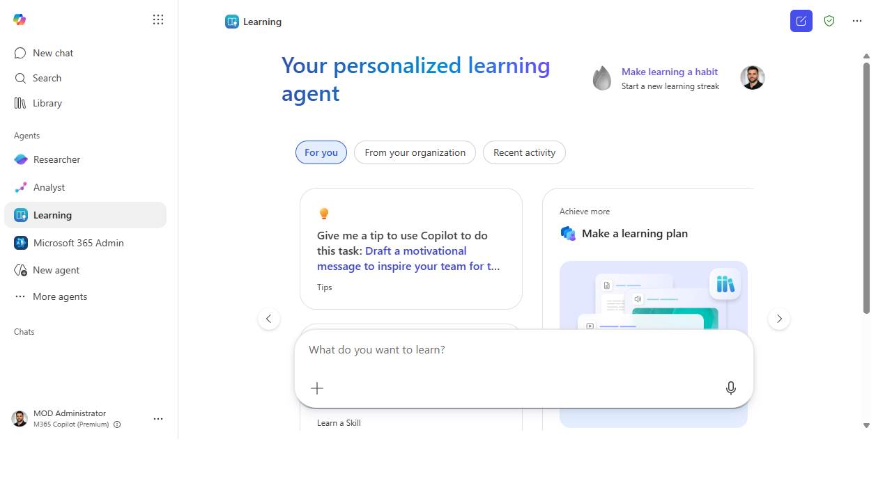
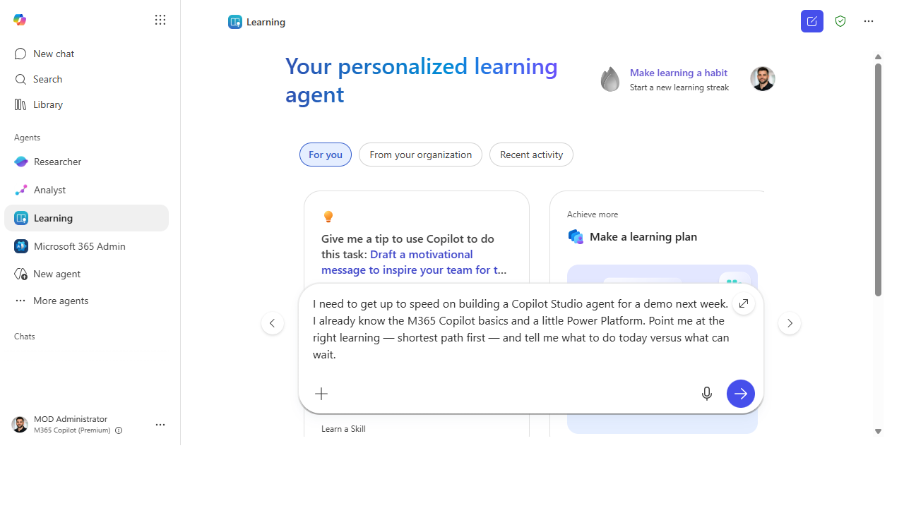
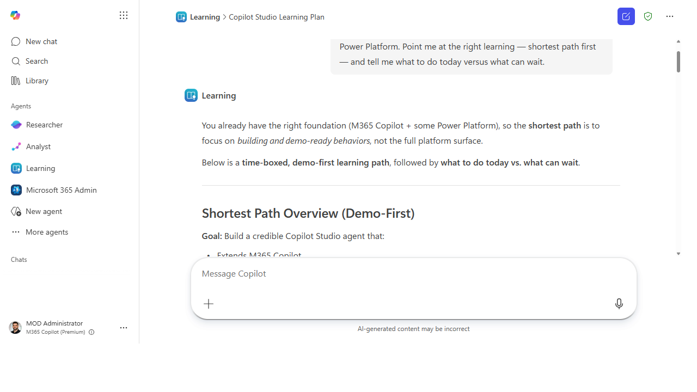
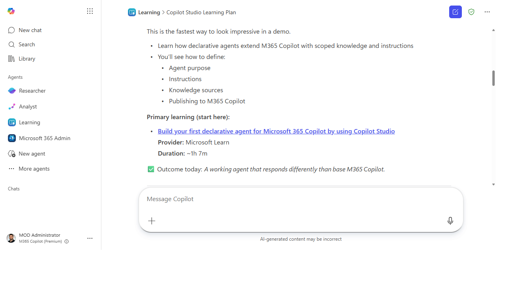

# Upskill in the flow of work with the Learning agent

> Learn the thing right when you need it. The Learning agent surfaces the right
> content — including LinkedIn Learning — at the moment a skill is in front of you, not weeks later in a
> course you forgot to take.

**Stage:** First-Party Agents · **For:** End user, Champion · **Level:** Starter · **Time:** 10 min

**Status:** Generally available — verify current availability on the [Agents in Microsoft 365 roster](https://adoption.microsoft.com/en-us/ai-agents/agents-in-microsoft-365/).

## When to use this
You've got a task next week that needs a skill you don't quite have yet — your first real pivot table, a
Copilot Studio agent, presenting to an exec. The old path was "go find a course someday." The **Learning**
agent collapses that: ask it what to learn, in the flow of the work, and it surfaces the right content
(including LinkedIn Learning) tuned to what you're actually trying to do. Learning lands when it's
*just-in-time*, and that's exactly when this agent meets you.

For champions, it's a force multiplier: instead of curating training decks, you point people at an agent
that meets each person at their own gap.

## What you'll need
- **M365 Copilot license** and access to the **Learning** agent
- A **specific, near-term goal** — "get ready to build a Studio agent by Friday" beats "learn AI"
- A few honest minutes on what you already know, so it can skip what you don't need

## Try it now — the prompt
Tie the ask to a real deadline and your starting point:

```
I need to get up to speed on [skill] for a [task] next week. I already know
[what you know]. Point me at the right learning — shortest path first — and tell
me what to do today versus what can wait.
```

**Why this works:** it gives the agent a **goal**, a **deadline**, and a **baseline**, then asks for a
**sequenced shortest path**. That turns "here are 40 courses" into "do these two things today" — the
difference between intending to learn and actually learning.

## Step by step
1. **Open the Learning agent and state the goal.** Lead with the task and the date, not the topic — "build
   a Studio agent by Friday" gives it everything it needs to sequence.
2. **Tell it your starting point.** A sentence on what you already know lets it skip the basics and aim at
   your real gap — the fastest learning is the learning you don't have to repeat.
3. **Take the first step now.** Do the "today" item immediately, while you're in the flow. In-the-moment
   learning sticks; bookmarked-for-later rarely happens.
4. **Come back when you're stuck on the real task:**
   ```
   I hit [specific snag] while doing [the task]. What's the one piece of learning
   that unblocks exactly this, right now?
   ```

## Screenshots

Captured live in the Microsoft 365 Copilot Learning agent (Work mode). The product UI moves fast — if what you see differs, trust the numbered steps above, which we keep current.


**Open the Learning agent and it greets you with "What do you want to learn?" plus tabs for you, your org, and recent activity.**


**Tie the ask to a real task and deadline — and say what you already know — so it can sequence a shortest path.**


**It returns a sequenced, demo-first plan — what to do today versus what can wait.**


**Each step links a specific course — provider and duration included — so you can start in one click.**

## Make it better
Just-in-time learning gets stickier with a little structure:
- **Learn against a real deliverable.** The skill sticks when you apply it the same day to actual work.
  Pick the task first, then the learning — never the other way around.
- **Champions: route, don't curate.** Instead of building a training catalog, teach your team to ask the
  Learning agent against their real goals. It scales to each person's gap in a way a fixed deck can't.
- **Close the loop with insights.** Use what your team is asking to learn as another adoption signal —
  it tells you where the real skill gaps are.

> **📚 Learn more.** The [Microsoft 365 Copilot Adoption Hub](https://adoption.microsoft.com/en-us/copilot/)
> and the [Copilot Success Kit](https://adoption.microsoft.com/en-us/copilot/success-kit/) collect
> Microsoft's user-enablement frameworks and templates for building skills across a team.

## Watch out for
- **A path you don't walk teaches nothing.** The agent can hand you the perfect sequence; only doing the
  first step today turns it into a skill. Bias hard toward "do one thing now."
- **Goal in, value out.** "Learn AI" gets you a generic list. "Build my first Studio agent by Friday" gets
  you a plan. Specificity is the whole game.
- **Availability varies.** The learning sources and the agent's reach depend on your tenant and licensing.
  Confirm what's wired up for you before you build a team ritual on it.

## Where this leads (the ramp)
The Learning agent is how you build the skills to *climb* the rest of this ramp. Point it at "I want to
build my first agent" and the next stage stops being intimidating — it becomes the thing you're learning
to do this week. That's **Stage 4 · Agent Builder**: your first taste of making, not just using.

> **Next:** [Agent Builder → Build a "team knowledge" agent over a SharePoint site](../walkthroughs/agent-builder-team-knowledge.md)

## Related
- [First-Party → The first-party agents included with your M365 Copilot license](../walkthroughs/first-party-agents-overview.md) — the roster
- [First-Party → Find where Copilot is landing with Workforce insights](../walkthroughs/first-party-workforce-insights.md) — where skill gaps show up as data
- Stage 2 Resources: see `RESOURCES.md` → First-Party Agents
