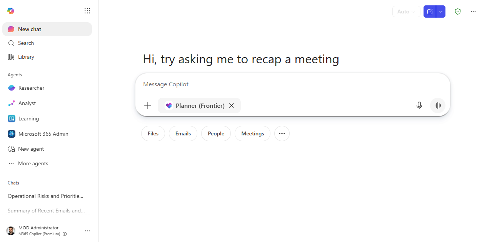
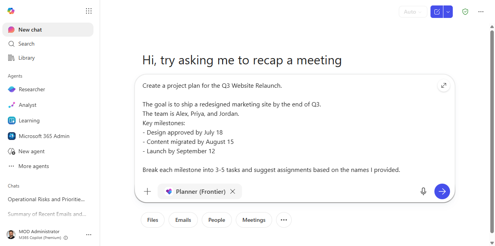
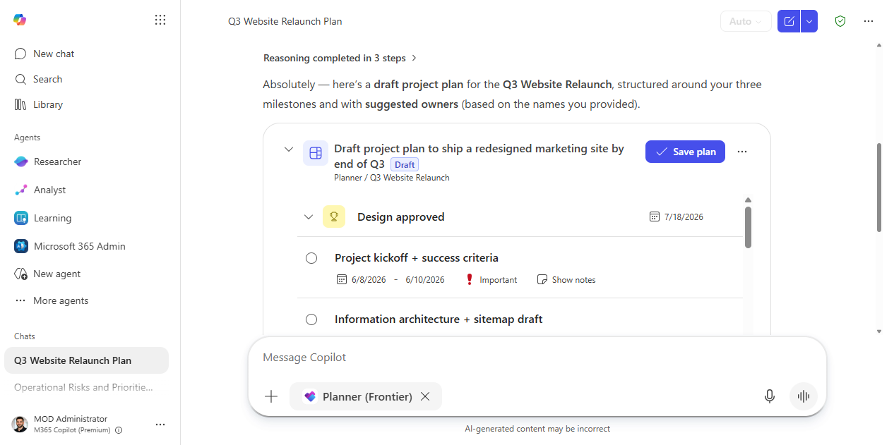
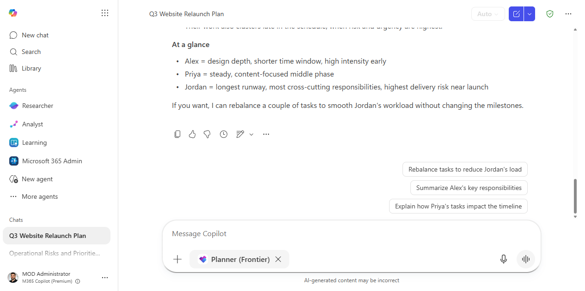

# Track project milestones with the Planner agent

> Go from a goal and a list of tasks to a structured, assigned project plan — by describing the project in plain language, not filling in a form.

**Stage:** First-Party Agents · **For:** Manager, Champion · **Level:** Intermediate · **Time:** 10 min

**Status:** Check current status — this agent isn't individually listed on the [Agents in Microsoft 365 roster](https://adoption.microsoft.com/en-us/ai-agents/agents-in-microsoft-365/); confirm availability there before assuming it's GA.

## When to use this

You're spinning up a project and need to create tasks, assign owners, and set due dates. Normally that means opening Planner or Project, creating a plan from scratch, and manually filling in each task. The Planner agent in Microsoft 365 lets you do that by describing the project conversationally instead.

This walkthrough covers using the Planner agent to create a project plan from a description, assign tasks to team members, and ask questions about status in plain language.

## What you'll need

- **M365 Copilot license** — Microsoft 365 Copilot Chat with access to the Planner agent
- A project goal and a rough list of tasks or deliverables
- Team member names (for assignment)

## Try it now — the prompt

Open Microsoft 365 Copilot Chat, add the **Planner** agent, and paste:

```
Create a project plan for [project name]. 

The goal is [goal in one sentence]. 
The team is [name 1], [name 2], [name 3].
Key milestones:
- [Milestone 1] by [date]
- [Milestone 2] by [date]
- [Milestone 3] by [date]

Break each milestone into 3-5 tasks and suggest assignments based on the names I provided.
```

**Why this prompt works:** Milestones give Planner a structure to work from. Asking for task breakdowns per milestone keeps the plan organized. Suggesting assignments saves a round of manual work.

## Step by step

1. **Open Microsoft 365 Copilot Chat** and access the Planner agent from the agent panel or by typing `@Planner` in the chat.
2. **Describe the project** using the prompt above. Include milestone dates and team names.
3. **Review the generated plan.** Ask for adjustments:
   ```
   Move the [task] from [person] to [person] and push the due date by one week.
   ```
4. **Check status in plain language.** After the project is running, ask:
   ```
   What tasks in [project name] are overdue or at risk?
   ```
   ```
   Which team members have the most open tasks right now?
   ```
5. **Get a status summary for a meeting:**
   ```
   Give me a 5-bullet project status update for [project] I can share in a standup.
   ```

## Make it better

- **From meeting notes:** paste in notes from a project kickoff and ask the Planner agent to extract the tasks and assignments.
- **Weekly nudge:** ask `"What was completed on [project] this week and what's coming up next week?"` before each standup.
- **Risk surfacing:** `"Are there any tasks with no due date or no owner in [project]?"` — finds gaps before they become problems.

## Screenshots

Captured live with the **Planner (Frontier)** agent in Microsoft 365 Copilot Chat.

**1. Add the Planner agent.** Start a new chat and attach **Planner (Frontier)** — type `@Planner` in the composer or pick it from the agent rail.


**2. Describe the project.** One prompt with the goal, the team, and dated milestones — no forms.


**3. A structured plan, ready to save.** Planner returns an editable plan — milestones as goals, 3–5 tasks each with start/due dates and priority — and a **Save plan** button to push it straight into Planner.


**4. Ask about it in plain language.** Follow-up questions get plain-language answers — here, who owns each milestone and whose workload is heaviest, with an offer to rebalance.


## Watch out for

- **A generated plan looks authoritative, but the dates and owners are guesses.** Confirm capacity before you save it into Planner.
- **“At risk / overdue” reflects what's in Planner, not reality.** If the team updates tasks late, the status lies.
- **Auto-assignment spreads work by what it can see, not by who's actually swamped.** Sanity-check the workload before you commit people.

## Where this leads (the ramp)

The Planner agent is great at standing up and tracking the plan; it still expects you to do the work inside each task. Cowork picks up from there, executing a multi-step task end to end across your apps rather than just listing it.

> **Next:** [Cowork: run an end-to-end task across apps](cowork-end-to-end-task.md)

## Related

- [Build a team-knowledge agent over a SharePoint site](../walkthroughs/agent-builder-team-knowledge.md)
