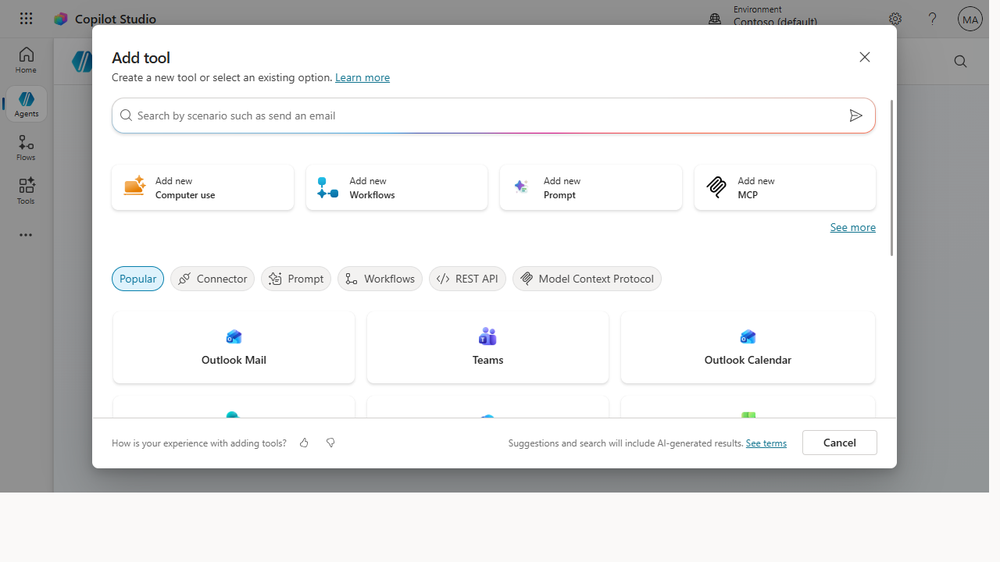

# Give a Studio agent a real action with a connector

> The leap from "agent that answers" to "agent that *does*" is a connector — wire one
> in so your agent can read and write to a real system, not just talk about it.

**Stage:** Copilot Studio · **For:** Maker, IT/Admin · **Level:** Advanced · **Time:** 25 min

## When to use this
Every agent up to now has *answered*. A Copilot Studio agent can *act* — look up an order, file a ticket,
update a record, kick off a flow — by calling a **connector** into a real line-of-business system. This is
the capability that justified climbing the whole ramp: an agent that takes action on your behalf, inside
your systems, with your guardrails. It's also where IT becomes a true co-builder, because actions touch
real data.

This is for makers building the action and IT/admins governing what the agent is allowed to reach.

## What you'll need
- **Copilot Studio access** in the right environment, and permission to use the connector you need
- A target system with an available connector (Dataverse, SharePoint, a Power Platform connector, or a
  custom one)
- IT alignment on what the agent may read and write — *before* you wire it up, not after

## Try it now — the prompt
Once the action is wired, the agent invokes it from natural language. Design the trigger phrasing
deliberately:

```
When a user asks to check an order status, call the [connector] action with their
order number, return the status and expected date in one sentence, and if the
order isn't found, say so and ask them to confirm the number.
```

**Why this works:** it ties a *user intent* (check order status) to a *specific action* (the connector
call), defines the *inputs and outputs*, and specifies the *failure path* — the four things a reliable
action needs so it doesn't misfire on a bad input.

## Step by step
1. **Add the action to your agent.** In Copilot Studio, attach the connector and the specific operation
   the agent should be able to call.
2. **Map the inputs and outputs.** Tell the agent what to pass in (the order number) and what to return —
   and keep the response tight so it doesn't dump raw fields at the user.
3. **Test with a real and a bad input.** Run a known-good case, then a missing one, and confirm both the
   success and failure paths behave. Actions fail loudly when inputs are wrong — design for it.
4. **Lock the scope with IT:**
   ```
   List exactly what this action can read and write, and confirm it can't reach
   anything outside the order-status data it needs.
   ```

## Screenshots

Captured live in Microsoft Copilot Studio (Contoso environment). The product UI moves fast — if what you see differs, trust the numbered steps above, which we keep current.


**The Add tool gallery is where an agent stops just answering and starts acting — wire in a connector (Outlook, Teams, and hundreds more) to read and write a real system.**

## Make it better
One action is the start of a capable agent:
- **Chain the next step.** Once it can read a record, teach it to act on one — "if the order's delayed,
  draft the customer a heads-up." That's where it earns its keep.
- **Add a confirmation gate.** For any write action, have the agent confirm with the user before it
  commits — a human-in-the-loop step that prevents expensive mistakes.
- **Reuse across agents.** A well-built action is a building block. Document it so the next agent you build
  can call the same one instead of reinventing it.

> **📚 Learn more.** The [Copilot Studio agent samples](https://learn.microsoft.com/en-us/microsoft-copilot-studio/guidance/agent-samples)
> show working agents with actions you can learn from, and the [microsoft/agent-resources](https://github.com/microsoft/agent-resources)
> repo collects build patterns. For the hands-on path, the
> [Copilot Studio in a Day workshop](https://microsoft.github.io/CopilotStudioSamples/guides/workshop/) walks
> through building actions end to end.

## Watch out for
- **An acting agent is a higher-stakes agent.** When it can write to a system, a bug isn't a wrong
  answer — it's a wrong *record*. Test write actions harder than you'd test a Q&A, and gate them with
  confirmation.
- **Scope the connector to least privilege.** The agent should reach exactly the data the action needs and
  nothing more. This is IT's call to enforce, not a nice-to-have.
- **Failure paths are not optional.** Real systems return errors, timeouts, and not-founds. An action
  without a designed failure response will surface raw errors to users — design every unhappy path.

## Where this leads (the ramp)
You've now built the thing this whole journey pointed at: an agent that takes real action inside your
systems. From here the path is depth, not a new stage — richer actions, multi-step orchestration, and
production-grade publishing. Build out from the working samples and the hands-on workshop.

> **Next:** [Copilot Studio → Publish and govern your agent](../walkthroughs/studio-publish.md)

## Related
- [Copilot Studio → Build your first Copilot Studio agent](../walkthroughs/studio-first-agent.md) — the Stage 5 flagship
- [Copilot Studio → Publish and govern your agent](../walkthroughs/studio-publish.md) — what comes after it works
- Stage 5 Resources: see `RESOURCES.md` → Copilot Studio
