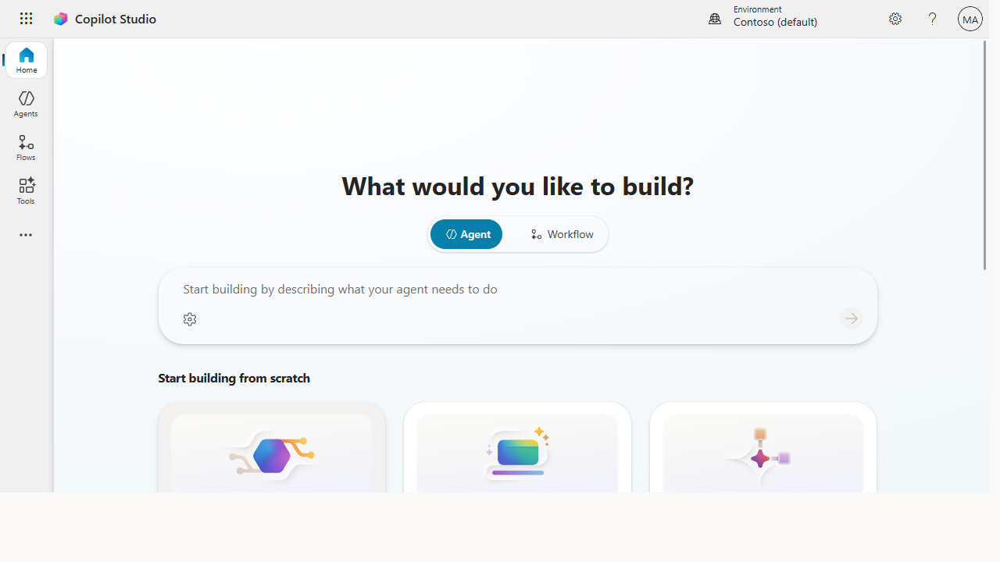
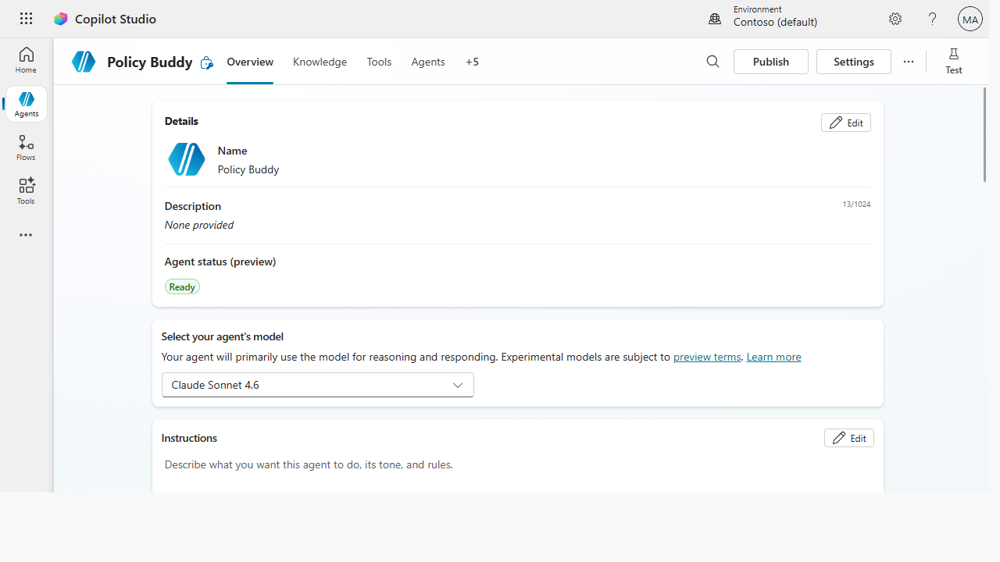
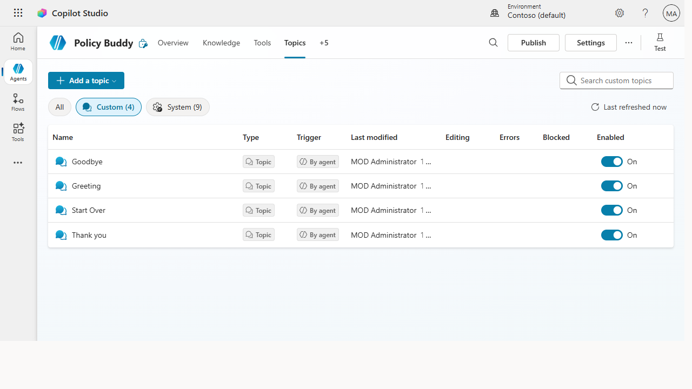

# Build your first Studio agent with a knowledge source + topic

> Go beyond answering questions — build a real agent with designed conversations
> and structured logic, the kind you ship to hundreds of people.

**Stage:** Copilot Studio · **For:** Maker · **Level:** Advanced · **Time:** 45 min

## When to use this
This is the low-code destination. Everything before this — using Chat, delegating to agents, building a
declarative agent — was the on-ramp. **Copilot Studio** is the pro-grade, low-code builder where you
make production agents.

You're here because your Stage 4 declarative agent hit a ceiling: you need more than "answer from
docs." You want a **designed conversation** — an agent that grounds on knowledge *and* drives a topic
(a structured flow with a clear happy path), so it does the right thing reliably, not just plausibly.
Studio gives you topics, richer grounding, testing, ALM, and a real publish-and-govern story.

## What you'll need
- **Copilot Studio access** (a Power Platform environment you can build in)
- A **knowledge source** — a SharePoint site, a set of docs, or a public URL the agent grounds on
- A **target** to publish to later (Teams and/or a website)
- A clear **use case** with one happy-path conversation you can name

## Try it now — the design
Before you click anything, outline the agent. Studio rewards a plan. Use this as your design prompt
(in Copilot Chat, or just on paper):

```
Outline a Copilot Studio agent for [use case]. Give me:
- The knowledge sources it should ground on
- 3 key topics (the structured conversations it needs to handle)
- The happy-path conversation for the most important topic, turn by turn
```

**Why this works:** a Studio agent is **knowledge + topics**, not just knowledge. Naming your 3 topics
and writing the happy path *first* means you build with intent instead of wiring trigger phrases at
random. The single biggest first-build mistake is skipping this and building topic-by-topic with no map.

## Step by step
1. **Create the agent in Copilot Studio.** Give it a name, description, and instructions — the same
   persona discipline from Stage 4 carries over.
2. **Add your knowledge source.** Point it at the SharePoint site / docs / URL. Test a question in the
   built-in chat to confirm grounding works before you add structure.
3. **Build your first topic.** Create a topic for your most important flow — set its **trigger
   phrases**, then lay out the **happy-path** conversation node by node (questions, conditions,
   messages). This is the step Agent Builder couldn't do.
4. **Test in the Test pane.** Walk the happy path. Then deliberately go off-script to see how it falls
   back to knowledge — tighten trigger phrases and nodes until it behaves.
5. **Publish to a channel.** Publish the agent and connect it to **Teams** (and/or a website) so real
   users can reach it. You've shipped, not just built.

## Screenshots

Captured live in Microsoft Copilot Studio (Contoso environment). The product UI moves fast — if what you see differs, trust the numbered steps above, which we keep current.


**Copilot Studio is the pro-grade builder — describe the agent, or start from scratch with an Agent, computer-using agent, or workflow.**


**The agent workspace: Overview, Knowledge, Tools, plus a built-in Test pane, a model selector, and the same instructions discipline from Stage 4.**


**Topics are the step Agent Builder couldn't do — structured conversations with their own triggers and a designed happy path.**

## Make it better
Your first Studio agent is the foundation. These are the natural next builds in this stage:
- **[Connect an action.](../walkthroughs/studio-connector-action.md)** Let the agent *do* things — look up an order, create a ticket — via a
  connector or action, not just answer.
- **[Add a tool / MCP integration.](../walkthroughs/studio-mcp-tool-integration.md)** Extend the agent with external tools for richer, real-world tasks.
- **[Govern and monitor.](../walkthroughs/studio-govern-monitor.md)** Once it's live, watch analytics, set guardrails, and manage versions with ALM.

> **📚 Learn more.** Start with the [Copilot Studio docs](https://learn.microsoft.com/en-us/microsoft-copilot-studio/)
> (get started → build → test → publish → govern), book the free hands-on
> [Copilot Studio in a Day](https://aka.ms/CSIAD) workshop, keep the
> [Copilot Studio Resources hub](https://aka.ms/copilotstudio/resources) bookmarked, and follow the
> product team's [Copilot Studio YouTube channel](https://www.youtube.com/@MicrosoftCopilotStudio).

## Watch out for
- **Topics need maintenance.** A designed conversation is powerful but isn't fire-and-forget — trigger
  phrases drift and flows need pruning. Plan to revisit.
- **Don't over-build the first one.** One knowledge source + one solid topic that you ship beats five
  half-finished topics that never publish. Get it live, then extend.
- **Governance is part of "done."** Before releasing to a wide audience, line up the publish + ALM +
  monitoring checklist — shipping to 500 users is a different bar than a demo.

## Where this leads (going deeper)
You've reached the low-code destination — and it has depth. From here the journey is *within*
Studio: wire up **connectors and actions** so the agent takes action, add **MCP / tool integrations**,
nail the **publish + governance** story, and **measure ROI** to justify and expand the program. When
low-code hits its ceiling, **Microsoft Foundry** ([Stage 6](../stages/stage-6-foundry.md)) is the
pro-code frontier beyond.

> **Next (within Stage 5):** [Connect an agent to a system with a connector / action](../walkthroughs/studio-connector-action.md)

## Related
- [Agent Builder → Build a team-knowledge agent over a SharePoint site](../walkthroughs/agent-builder-team-knowledge.md) — the no-code agent you outgrew to get here
- [Studio → Govern and monitor agents at scale](../walkthroughs/studio-govern-monitor.md)
- Stage 5 Resources: see `RESOURCES.md` → Copilot Studio
