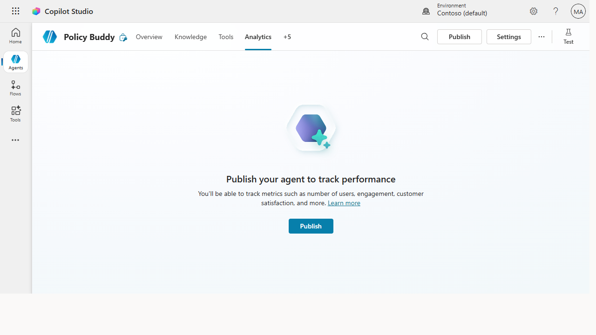
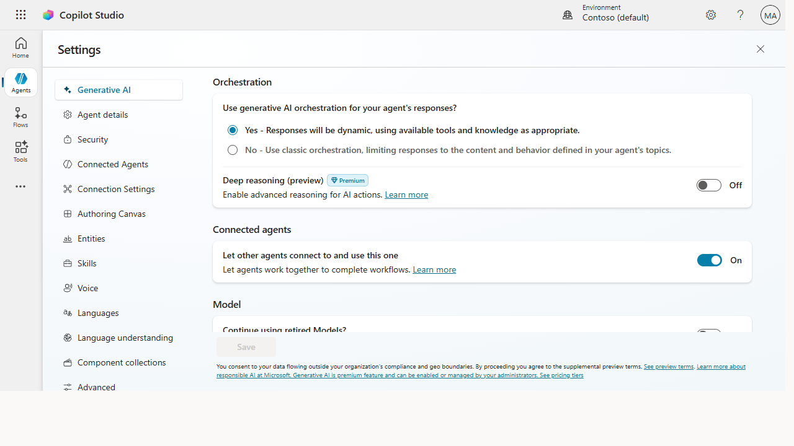

# Govern and monitor your agents at scale

> One agent is a project; a fleet is a platform. Governance and monitoring are what
> keep a growing set of agents safe, compliant, and trusted — so the program scales up instead of quietly
> sprawling out of control.

**Stage:** Copilot Studio · **For:** IT/Admin · **Level:** Advanced · **Time:** 20 min

## When to use this
Your makers are succeeding — which is exactly the problem. What started as one support agent is now a dozen
agents across teams, each with its own knowledge sources, connections, and access. Without a governance
layer, you can't answer the questions that matter: *Which agents are live? What can they touch? Is anything
leaking data or going stale?* **Governance and monitoring** give you that control plane — a weekly view of
the whole fleet and the guardrails that keep new agents inside policy from the start. This is what turns an
enthusiastic pilot program into a durable platform leadership will keep funding.

This is the IT/admin's stewardship role. You're not blocking makers — you're giving them a safe road to build on.

## What you'll need
- **Admin rights** to your Copilot Studio environments and the **analytics / monitoring** surface
- A **defined policy baseline** — data boundaries (DLP), authentication, and who can publish what
- A **weekly review habit** — governance is a cadence, not a one-time setup

## Try it now — the prompt
Turn "watch everything" into a focused weekly checklist:

```
Help me build a weekly governance checklist for our published Copilot Studio
agents. Cover usage, errors, data access, and stale knowledge. For each, tell
me what healthy looks like and the red flag that means I need to act.
```

**Why this works:** it scopes monitoring to **four things that actually matter** — usage, errors, data
access, stale knowledge — and pairs each with a **healthy baseline and a red flag**. A dashboard with
everything on it gets ignored; a four-line checklist with clear thresholds gets done every Monday.

## Step by step
1. **Set the policy baseline first.** Define data boundaries, authentication, and publishing rights at the
   environment level so every new agent inherits the guardrails — governance by default beats governance by
   audit.
2. **Inventory the live fleet.** Know every published agent, its owner, its knowledge sources, and what it
   can access. You can't govern what you can't see — the inventory is the foundation.
3. **Watch the weekly signals.** Usage trends, error rates, and data access — read at the fleet level, not
   per-conversation. Rising errors or an agent touching data it shouldn't is your cue to act.
4. **Turn a red flag into an action:**
   ```
   One of my agents shows a spike in failed responses this week. Walk me
   through how to diagnose it: what to check first, likely causes, and how to
   tell a knowledge problem from a connection problem.
   ```

## Screenshots

Captured live in Microsoft Copilot Studio (Contoso environment). The product UI moves fast — if what you see differs, trust the numbered steps above, which we keep current.


**Analytics is the monitoring half — once published, the agent tracks usage, engagement, and satisfaction so you can read fleet-level signals weekly.**


**Settings is the governance half — orchestration, moderation level, security, and data-boundary controls are the guardrails every agent inherits.**

## Make it better
Governance matures from gate to guardrail:
- **Shift left.** Bake the policy into the environment so makers build inside the lines automatically,
  rather than catching problems in an after-the-fact audit. Prevention scales; review doesn't.
- **Assign owners and review dates.** Every agent needs a named owner and a recheck cadence, or knowledge
  silently goes stale and answers drift wrong. Ownership is the antidote to rot.
- **Report the fleet's health up.** A simple monthly "agents live, usage, issues caught" summary keeps
  leadership confident — and that confidence is what funds the next wave of building.

> **📚 Learn more.** The [Agent governance whitepaper + Agent 365](https://aka.ms/agent365/resources)
> covers lifecycle, compliance, data security, and responsible AI for agents at scale, and the
> [Copilot Studio admin & governance docs](https://learn.microsoft.com/en-us/microsoft-copilot-studio/)
> walk through environments, DLP/data policies, authentication, and analytics.

## Watch out for
- **Governance that blocks makers gets routed around.** If the safe path is slow, people build in the
  shadows. Make the compliant path the *easy* path, or you'll lose visibility entirely.
- **Stale knowledge is the silent failure.** An agent rarely breaks loudly — it just starts giving outdated
  answers. Review dates on knowledge sources catch what error rates won't.
- **Don't surveil conversations.** Monitor fleet health and policy compliance, not what individuals typed.
  Cross that line and you poison trust in the whole program — keep the lens on the system, not the person.

## Where this leads (the ramp)
Once you can see the fleet's health, you can prove its worth. The usage and outcome data you're already
watching for governance is the same raw material that builds the ROI case — the argument that turns a
tolerated experiment into a funded platform. That's the final move: **make the business case**.

> **Next:** [Copilot Studio → Measure ROI and build the business case](../walkthroughs/studio-roi-business-case.md)

## Related
- [Copilot Studio → Publish your agent to Teams and the web](../walkthroughs/studio-publish.md) — the publish step governance wraps around
- [Copilot Studio → Measure ROI and build the business case](../walkthroughs/studio-roi-business-case.md) — where fleet data becomes a funding argument
- Stage 6 Resources: see `RESOURCES.md` → Copilot Studio
