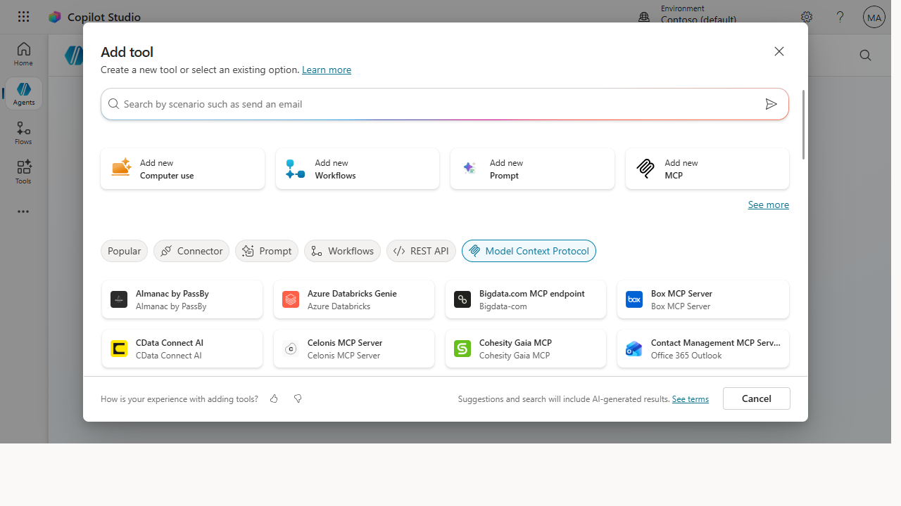

# Add an MCP tool integration to your Studio agent

> Knowledge lets an agent *answer*; tools let it *act*. Wiring an MCP server into your
> Studio agent turns "here's what the docs say" into "done — I just looked it up in the live system and
> made the change."

**Stage:** Copilot Studio · **For:** Maker · **Level:** Advanced · **Time:** 20 min

## When to use this
Your agent answers questions well, but users keep asking it to *do* things — "check the order status,"
"create the ticket," "pull the current inventory." Grounding on documents can't do that; it only knows what
was written down. **An MCP (Model Context Protocol) tool integration** connects your agent to a live system
through a standard interface, so one MCP server can expose a whole set of actions the agent calls on demand.
It's the move that takes an agent from informative to operational — the same pattern behind real-world demos
that connect Studio agents to back-office systems like supply chain and finance.

This is a maker's leverage point. One well-built MCP connection unlocks every tool that server exposes.

## What you'll need
- A **Copilot Studio agent** you can edit and the rights to **add tools / actions**
- An **MCP server endpoint** that exposes the operations you want (and its auth details)
- A **clear list of the actions** you want the agent to take — and which should require confirmation

## Try it now — the prompt
Before wiring anything, design the tool surface so you connect the *right* operations:

```
I'm connecting a [supply chain] agent to an MCP server. List the 5 tools it
most likely needs, and for each: what it does, what inputs it takes, what it
returns, and whether it should run automatically or ask the user first.
```

**Why this works:** it forces a **tool-by-tool spec** — name, inputs, outputs, and a **safety call on
confirm-vs-auto** — before you touch configuration. The number-one way an agent-plus-tools goes wrong is a
write action firing when it should have asked; deciding that up front is how you avoid it.

## Step by step
1. **Register the MCP server as a tool source.** Add the server endpoint to your agent and authenticate it.
   One connection makes every tool that server exposes available to the agent.
2. **Select and describe the tools.** Pick the specific operations to expose and give each a clear
   description — the agent uses that text to decide when to call it, so vague descriptions cause wrong calls.
3. **Set confirmation on write actions.** Read actions can run freely; anything that changes a system should
   pause for the user. Gate the writes — that single setting prevents most "it did *what*?" moments.
4. **Test the happy path and a refusal:**
   ```
   Write a test plan for my agent's MCP tools: one happy-path scenario per
   tool, plus 3 cases where the tool should NOT fire or should ask first.
   Tell me what correct behavior looks like for each.
   ```

## Screenshots

Captured live in Microsoft Copilot Studio (Contoso environment). The product UI moves fast — if what you see differs, trust the numbered steps above, which we keep current.


**Filter the tool gallery to Model Context Protocol — connect an existing MCP server or add your own, and the agent gains every action that server exposes.**

## Make it better
A tool connection gets sharper with discipline:
- **Start with read-only.** Ship the lookups first, prove they're reliable, then add write actions once
  you trust the agent's judgment about when to call them.
- **Borrow from the samples.** The Microsoft-owned Studio sample repos show working tool and connector
  patterns — adapt a proven one rather than wiring from a blank canvas.
- **Name tools for what they do.** "get_order_status" beats "tool3." The agent picks tools from their names
  and descriptions, so clear naming is functional, not cosmetic.

> **📚 Learn more.** The [Copilot Studio official docs](https://learn.microsoft.com/en-us/microsoft-copilot-studio/)
> cover building, testing, and connecting agents end to end, and the
> [Copilot Studio & agent samples](https://learn.microsoft.com/en-us/microsoft-copilot-studio/guidance/agent-samples)
> give you Microsoft-owned starting points for tool and connector integrations.

## Watch out for
- **Write actions need a human gate.** An agent that creates, updates, or deletes without confirmation is a
  liability. Default writes to "ask first" until you've proven the trigger logic.
- **Bad descriptions cause bad calls.** The agent can't see your intent — only the tool's description. A
  fuzzy description means the agent fires the wrong tool at the wrong time. Write them precisely.
- **Mind auth and data scope.** The agent acts with whatever permissions the connection carries. Scope the
  MCP server's access tightly and loop in IT on what data and operations are appropriate to expose.

## Where this leads (the ramp)
An agent that can act is only valuable once it's in users' hands — and acting agents raise the stakes on
*how* you release. A tool that changes real systems needs a real publish-and-governance checklist before it
reaches 500 people. That's the next step: **ship it safely**.

> **Next:** [Copilot Studio → Publish your agent to Teams and the web](../walkthroughs/studio-publish.md)

## Related
- [Copilot Studio → Connect an agent to a system with a connector / action](../walkthroughs/studio-connector-action.md) — the connector cousin of MCP tools
- [Copilot Studio → Build your first Studio agent with a knowledge source + topic](../walkthroughs/studio-first-agent.md) — the agent you're extending
- Stage 6 Resources: see `RESOURCES.md` → Copilot Studio
